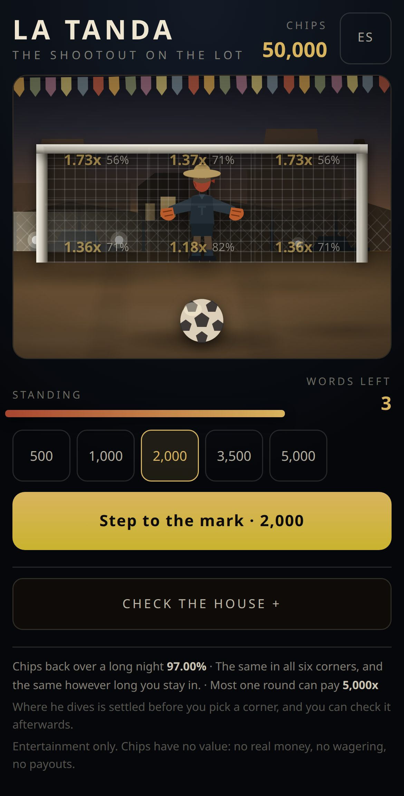
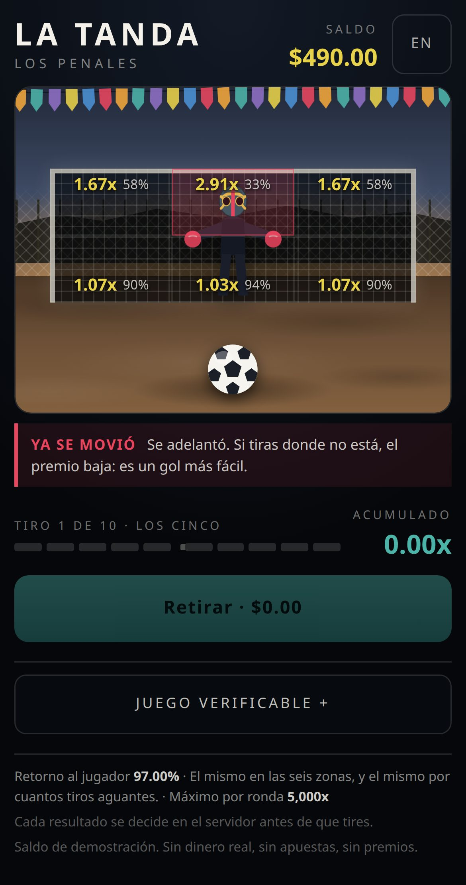
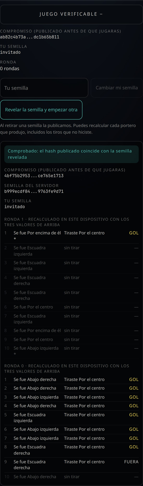

# LA TANDA · 空地上的那一局

镇子边上一块平地,1884 年。两根木杆一根横木、四角用绳绑着,
一个把围巾拉到鼻子上的人站在中间,五个球,之后是突死。

**纯娱乐模拟、不涉真实货币、不设投注、不发奖金。** 筹码只是筹码,
片头与台面都明示。

选题、玩法与史实论证见 [../PENALES.md](../PENALES.md)。
这份文档只讲怎么跑它、它是怎么分层的,以及哪些结论是量出来的。



---

## 跑起来

```bash
npm install
npm run dev            # http://localhost:5173
```

开发服务器和静态构建都把庄家(`House`)跑在页面里,
因为静态站没有别的地方放它。**这是演示,不是产品形态**,
而它无害的原因正是边界存在的原因(见下面第二节)。
把庄家挪到页面外面是一条命令:

```bash
npm run serve                                   # 庄家挂在 127.0.0.1:8787
VITE_API=http://127.0.0.1:8787 npm run dev      # 客户端连过去
```

两种方式玩的是同一个游戏,而客户端一行都不用改。

### 检查

```bash
npm run verify         # lint + 类型 + 103 个测试 + 返还率报告
npm run rtp            # 精确返还率 + 按策略的模拟报告
```

活体检查需要一个开发服务器在跑:

```bash
npm run dev -- --port 5190 --strictPort --host 127.0.0.1
npm run verify:play    # 在真浏览器里玩,跟着一枚筹码走一圈
npm run shots          # 重拍 docs/ 里的截图
```

`--host 127.0.0.1` 是有用的:Vite 绑 `localhost`,
node 把它先解析成 `::1` 并且只绑在那儿,
于是脚本请求 `127.0.0.1` 会被拒绝,而服务器日志说它准备好了。
这件事在这个仓库的兄弟桌子上花掉过四次红色 CI。

---

## 分层,这是这个原型真正要证明的东西

```
src/game/        没有时钟、没有 React、没有状态的纯逻辑
  sha256.ts        手写的 SHA-256 / HMAC,对过公开向量
  fair.ts          承诺、推导、揭示
  table.ts         六个角、赔率、破绽、一脚的结算
  exact.ts         精确返还率:枚举,不是测量
  strategies.ts    几种打法 + 模拟器
src/server/      庄家。一切做决定的地方
  store.ts         事务边界。提交就是一次指针交换
  ledger.ts        复式记账。只有 post(),没有 debit()/credit()
  service.ts       局的生命周期,和唯一那个脱敏函数
  http.ts          同一个庄家挂在真 socket 上的适配器
src/client/      界面。什么都不决定
  api.ts           传输边界(页内 / HTTP),幂等键在这里生成
  Pitch.tsx        空地、球门、守门员、六个角
  Verify.tsx       玩家在自己机器上重算我们
```

### 1. 客户端不持有能算出结果的信息

不是"不被信任"——是**没有**。种子活着的时候 server seed 只存在于
`House` 里,客户端拿的是它的哈希。于是没有校验路径可以写错、
没有签名可以忘记验,而被改过的客户端除了请求另一个角什么都做不到,
那本来就是它有权提的请求。

`service.test.ts` 断言的是**序列化之后的整个视图**里不含那个种子,
而不是逐个字段检查——这样以后新加的字段没法靠"没被这个测试提到"漏出去。

### 2. 边界是一个边界,不是一个命名约定

`src/client/api.ts` 是一个接口和两个实现;`src/server/http.ts` 是另一侧。
页内庄家**不**证明保密性(页面里的庄家,种子就在页面里,
开个调试器就能读)。它证明的是**界面不依赖读到它**:
客户端要一个视图,拿到一份脱敏,和走 socket 一模一样。
`npm run serve` 让这句话可以被检查,而不是被断言。

### 3. 资金移动和批准它的状态一起提交

```
开局    扣注码 AND 建局          一次事务
结算    派彩 AND 关局            一次事务
```

没有任何代码路径能只做一半。幂等键在**玩家意图形成的地方**生成,
不在重试循环里——按一次"retirar"就是一次结算,无论请求发出去几次。

`store.test.ts` 用崩溃注入验这件事:进程在"全部工作做完、还没提交"
那一瞬间死掉,余额、局、日志一个都没动
(断言的是**同一个对象引用**,因为提交就是一次指针交换);
同键重试恰好付一次;第三次什么都不付。

**输球没有第二次资金移动**,因为注码在开局就走了。
这不是优化,这是"输的那一个球崩溃不可能让任何人损失"的原因。

### 4. 动画永远不是权威

球飞是因为庄家说进了,绝不反过来。请求先发出去,
然后花掉已经承诺的飞行时间:答案来早了,飞行照样走完
(球还没离脚守门员就扑出去,看起来像 bug);
答案来晚了,飞行停住**并且说出来**。

代码里**没有任何一处乐观更新**。

---

## 量出来的数字

`npm run rtp` 的输出。精确的那几行是枚举出来的,不是测的。

| | |
| --- | --- |
| 配置返还率 | **97.00%**(房屋优势 3%) |
| 精确返还率,无上限 | **97.00%**,六十条固定角阶梯全部如此,到十二位小数 |
| 精确返还率,含 5,000x 上限 | **96.99%**(代价 0.0063 pp) |
| 上限被达到的概率 | 约 2e-9 |
| 六个角的 P(进球) | 55.97% – 82.16% |
| 露手概率 | 18% |
| 注码范围 | 500 – 5,000 枚筹码 |

**阶梯类游戏的返还率不能靠模拟定。** 一个永不兑现的策略把全部回报
塞进 0.26% 的局里,标准误差好几个百分点,而且那是方差的限制不是样本量的限制。
`src/game/exact.ts` 因此枚举每一条信息分支(每球三条,十球 3¹⁰ 条)。
模拟留下来抓算术和代码之间的分歧,而报告会**说清楚它的样本量
能分辨哪几个策略、哪几个不能**——而不是在一个八个百分点的
标准误差旁边印 97.00% 然后说"符合"。



上图是露手,而且是在已经进了四个、2.12x 骑在上面的时候露的手:
**左下角被标红**——他要去那儿,所以射那个角只有 25% 会进,赔率因此最高;
而他离开的每个角都被重新定价成"只剩你自己要打赢"的价钱
(58% / 74% / 94% / 90%,正好是那四个角的命中率)。
**返还率一分没变。**

### 一个故意的不对称,别把它"修好"

板上的赔率是**向下**取到两位小数的,而赔付用的是精确值。
所以 `2.12x × 2000` 算出来是 4,240,而按钮上写的是 4,258——
玩家拿到的比板上写的**多**一点。

这个方向是被测试锁住的(`table.test.ts` 的 "never promises more than it pays"),
而反过来会很糟:按显示值赔付会让返还率损失最多 0.85%,
**而且损失量随赔率大小而变**,于是"六个角完全一样"这句话就不再成立。
筹码数才是权威数字,所以它被放在按钮上最显眼的位置;
赔率是进度读数。



---

## 三个只有在浏览器里玩才会发现的问题

`npm test` 全绿完全可以发生在一张没人能玩的桌子上。
`scripts/verify-play.mjs` 在真浏览器里玩,跟着一枚筹码从余额走到派彩再走回来,
它找到了这些:

1. **一个 CSS 类名冲突。** 验证面板里"进球"那一行的 class 是 `goal`,
   球门也是 `goal`,于是每一个进球都被绝对定位到球场正中间。
2. **结束的局把旧阶梯留在赔率板上**,在广告第十一个球会赔多少——
   一个不存在的报价,而它读起来像一个承诺。
3. **扑救之后球从球门里缓缓飘回罚球点。** 没有人这样摆球。

另外几个是看截图看出来的:画成暗色的守门员在绳网前消失,只剩描边活下来;
标签被印在他脸上(因为守门员的头**必然**在中上那个角里);
第一次重新配色把明度结构搞反了,地面比天空还亮,
因为落日的光源被放到了画面下沿之外。

还有一个是改文案改出来的:`verify-play.mjs` 原来拿判决的**文字**
去匹配 `/GOL|GOAL/`,于是把 "GOAL" 改成 "IN" 之后整个检查变成了超时。
现在它读 class。**一个改文案就会坏的浏览器检查,是一个没人会留着的检查。**

---

## 已知缺口

- **音频:**一个字都没有。
- **真实素材:**每个像素都是占位,插槽见 [../PENALES.md](../PENALES.md) 第八节。
- **没接进赌馆:**没有共享的一夜、一副筹码、一份热度。
- **西班牙语:**照北墨语感写的草稿,还没有母语者审过。
- **`verify-timing.mjs`:**露手目前是回合级的,所以还不需要;
  如果以后做成"只在那几帧里看得见",它立刻就需要。
