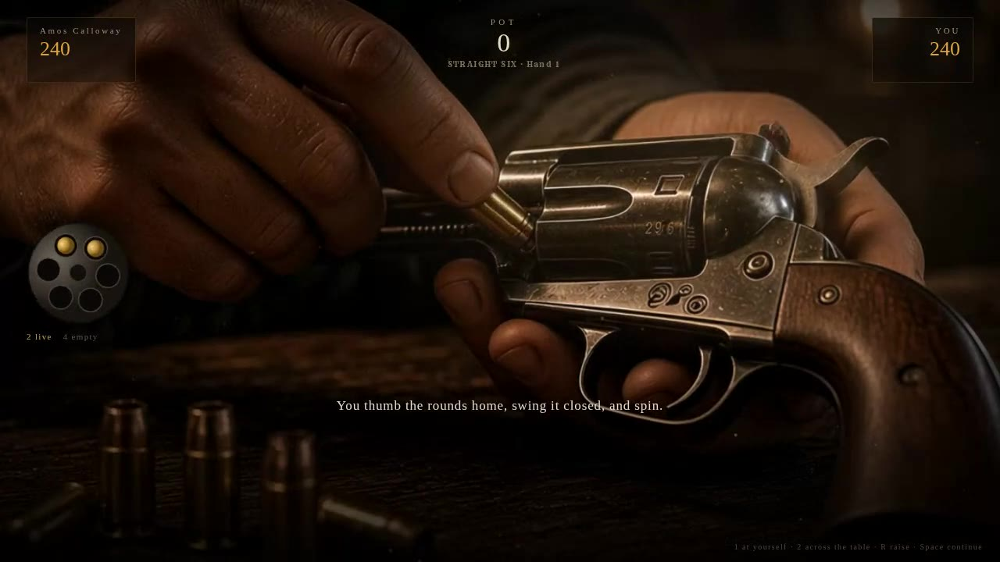
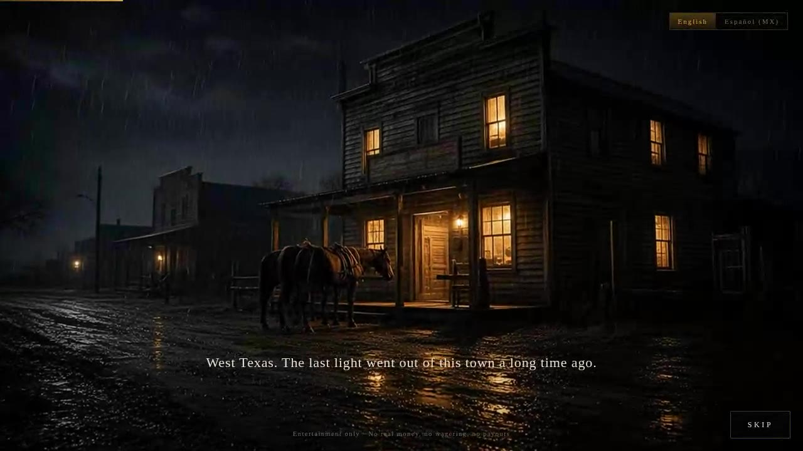
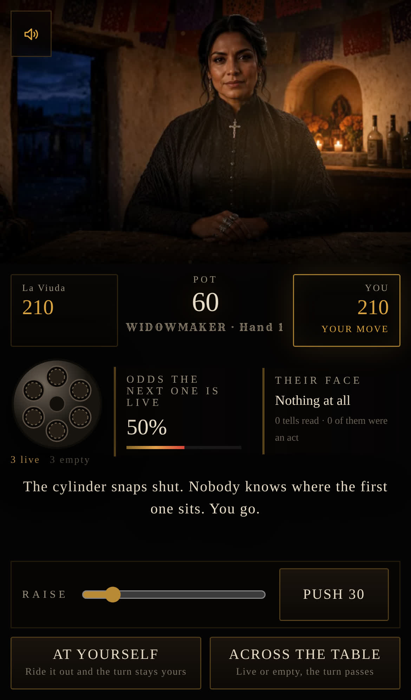

# THE LAST ROUND · LA ÚLTIMA BALA

一个网页版、西部写实风格的回合制左轮对赌游戏。

酒馆或坎蒂纳里一张木桌，对面坐着一个人，桌上一把左轮。装几发实弹、
轮流扣扳机、轮流加注，中枪的一方输掉这一局。

**纯娱乐模拟，不涉及任何真实货币、不设投注、不发奖金。** 标题页与选桌页
都明示了这一点。


---

## 直接试玩

预览站是从这条分支自动构建的，无需登录、无需账号，打开就能进选桌页。

| 地址 | 说明 |
| --- | --- |
| **https://solaier2024.github.io/test/** | 主地址。需要仓库管理员先在 Settings → Pages 里把 Source 选成 "Deploy from a branch" → `gh-pages` / `(root)`，之后每次推送自动更新 |
| **https://raw.githack.com/solaier2024/test/gh-pages/githack/index.html** | 镜像，现在就能打开。githack 会先弹一次 "External Content Notice"，点 "Open the page" 即进入游戏 |

两个地址指向同一次构建：`gh-pages` 分支根目录是 Pages 版（base 为 `/test/`），
`githack/` 子目录是镜像版（base 为 `/solaier2024/test/gh-pages/githack/`）。

`public/` 里的素材 Vite 不会改写 URL，所以所有图片路径都过一次
`import.meta.env.BASE_URL`（见 `src/art.ts`），换个托管位置只要改
`vite.config.ts` 里的 `base`。`scripts/verify-deploy.mjs <url>` 会用无缓存的
浏览器把部署好的站当新访客走一遍：任何 HTTP 4xx/5xx、控制台报错、没解码出来
的图，或者**播不动的片子**，都会让它失败。实测输出：

```
opening:      intro.webm, 1280px, +1.21s
title card:   THE LAST ROUND
disclaimer:   Entertainment only · No real money, no wagering, no payouts
table picker: STRAIGHT SIX | QUICK DRAW | WIDOWMAKER | EL PASE | Amos Calloway | La Viuda
plates:       6 loaded, 0 broken
table clip:   chamber_saloon.webm, 1280px, +0.98s

OK: reachable, film rolls, table picker renders, all assets load
```

素材全了但一段视频都没播出来，同样是坏的部署——只看图和 HTTP 状态码是发现不了的。


---

## 现在有什么

| | |
| --- | --- |
| 玩法模式 | 4 种（规则由数据驱动，加一种是改配置不是改逻辑） |
| 对手 | 2 位，可与任意模式自由组合 |
| 场景 | 2 个（西德州酒馆 / 科阿韦拉坎蒂纳），跟着对手走 |
| 语言 | 英文（默认）+ 西班牙语 es-MX，可随时切换并记忆 |
| 开场 CG | 10.3 秒五镜头片头，可随手一点跳过，中英西双语字幕 |
| 动态片段 | 11 段，桌面 / 移动两套码率，抽枪・开火・中枪・装弹・呼吸全走视频 |
| 角色成片 | 每位对手 6 张全幅状态图，共 12 张（现在是视频的兜底与首帧） |
| 配乐 | 全程序合成的西部小乐队，编曲强度跟着实弹概率走；片头另有一条卡点配乐 |
| 移动端 | 竖屏专用布局、44px 触控区、安全区避让、无 hover 依赖 |
| 引擎测试 | 30 项，含 **每种模式 120 局全自动模拟** |

---

## 四种玩法模式

选桌页把每种模式与"房规"并列，差异是写清楚的，不需要玩家自己试出来。


| 模式 | 弹巢 | 装弹 | 下注 | 独有规则 |
| --- | --- | --- | --- | --- |
| **STRAIGHT SIX**（房间的基准玩法） | 6 | 你装 1–5 发 | 加注 / 跟 / 弃 | —— |
| **QUICK DRAW** | 4 | 固定 1 发 | 只有底注 | 不能加注；所有镜头节奏 ×0.62，一局约一分钟 |
| **WIDOWMAKER** | 6 | 你装 3–5 发 | 加注 / 跟 / 弃 | 每熬过一个空仓，**双方各被强制再抽 18 进桌心** |
| **EL PASE**（坎蒂纳规则） | 6 | **对手替你装** 2–5 发 | 加注 / 跟 / 弃 | 每局每人可花 30 把枪**不开火直接推过去**一次 |

设计意图很直接：

- **QUICK DRAW** 去掉全部下注层，只剩"对己开枪抢节奏"这一条核心博弈，
  用来解决"想再来一局但不想再来五分钟"的场合。
- **WIDOWMAKER** 把"拖"变成一种输法。实弹起步就是一半，桌心还会自己长大，
  于是弃牌的代价随着时间上升，逼人早做决定。
- **EL PASE** 拿走"装弹"这个信息优势——对手替你决定风险——再用"过枪"
  这个可购买的逃生口把主动权还一部分回来。这是四种里唯一会出现
  "我明知下一发必响，但我买得起这一次"的局面。


`riskMultiplier` / `anteFor` 都是按模式内**最轻装弹量**归一的，所以
Widowmaker 装 3 发算它自己的底档，不会因为绝对数值大就凭空贵一截。

---

## 两位对手，两个场景

对手和模式是**正交**的：你可以在坎蒂纳打 Quick Draw，也可以让 Calloway
陪你玩 El Pase。场景跟着对手走，不跟着模式走。


| | Amos Calloway | La Viuda |
| --- | --- | --- |
| 场景 | Bitter Creek Saloon · 西德州 | Cantina La Cruz · 科阿韦拉 |
| 演戏概率 | 28% | 42% |
| 进攻性 | 0.55 | 0.68 |
| 胆量（多高的概率之下还肯对己开枪） | 0.50 | 0.58 |

La Viuda 更难读也更难逼退，所以她是"你已经摸清 Calloway 之后"的那一档。
角色设定刻意避开刻板印象：她是这张桌子的主人，不是背景板。


---

## 本地化

英文是唯一的事实来源，`src/i18n/strings.ts` 里 `Strings` 接口把每一条
文案都列了出来，漏翻会直接编译不过。

西班牙语不是逐字翻译，是按墨西哥北部的语感重写的：
`PASS THE IRON` → `PASAR EL FIERRO`，`FOLD` → `RETIRARSE`，
`Alive beats even` → `Vivo vale más que a mano`。
标题也不是直译（`THE LAST ROUND` / `LA ÚLTIMA BALA`）。

**引擎里已经一个字符串都不剩了。** 第一阶段 `GameState` 上挂着一个
`log: string[]`，那等于把翻译层强行塞进游戏规则里；这一阶段整个删掉，
文案全部由 UI 层持有，`engine.ts` 只吐结构化结果。

---

## 动态化：让核心动作真的动起来

之前每个状态是一张静止成片，动作靠溶解交代——抽枪是"没举枪"淡成"举着枪"，
装弹只有一行旁白。**幻灯片撑不住这两个动作，因为它们有意思的部分全在中间那一段。**

这里没有可用的视频生成工具，但有一个别的条件：所有成片都是**同机位**渲染的。
两张只差一个动作的图，正是光流插值要的输入。于是流程变成：

```
两张关键帧  →  ffmpeg minterpolate 稠密光流  →  按缓动曲线重采样  →  VP9 / H.264
```

`scripts/build-clips.mjs` 一条命令跑完：

```bash
node scripts/build-clips.mjs              # 全部
node scripts/build-clips.mjs cowboy_fire  # 只重建某几段
FORCE=1 node scripts/build-clips.mjs      # 忽略缓存
```

### 片段清单

| 片段 | 帧数 | 时长 | 何时播 |
| --- | --- | --- | --- |
| `{cowboy,viuda}_idle` | 150 | 5.0s | 桌面空闲时循环——吸气、呼气、眨眼，无缝接回 |
| `{cowboy,viuda}_raise` | 29 | 0.97s | 对手把枪抬向你 |
| `{cowboy,viuda}_fire` | 21 | 0.70s | 对手扣下扳机 |
| `{cowboy,viuda}_hit` | 45 | 1.50s | 对手中枪后仰 |
| `chamber_{saloon,cantina}` | 73 | 2.43s | 装弹：切到双手推弹、合巢、转轮的特写 |
| `intro` | 310 | 10.33s | 开场 CG |

每段都出两个尺寸（1280×720 与 768×432）两种编码（VP9 / H.264），
外加一张 poster 首帧。整套 `public/clips/` 8.3 MB，
**手机档单段动作片只有 44–75 KB**，片头 335 KB。

### 三个踩过的坑

**`minterpolate` 会丢掉首尾两个区间。** 直接喂两张图出来 0 帧。
把输入垫成 `[A, B, B]` 才剩下一个区间可渲染，输出恰好 `steps+1` 帧。

**那些 `.png` 成片其实是 JPEG。** `file` 一看就知道，而 ffmpeg 的 image2
解复用器认扩展名不认字节，于是被静默丢弃——一段本该 21 帧的片子编出来 13 帧，
不报错。现在每一帧先过一遍 `normalised()` 转码，并在编码后断言帧数一致。

**光流很贵，改时序不该重跑它。** 每对关键帧只算一次 48 步稠密形变并缓存，
之后所有时序都是在这条曲线上按 `easeOut` / `easeInOut` 重采样出来的。

### 视频层是"叠上去"的，不是"换掉"

`<Clip>` 铺在成片之上，**每段片子的首尾帧本身也是一张成片**。于是：

- 播之前底下的成片已经切到片子的末帧，片子放完撤掉——没有跳帧
- 片子在上面挡着的时候，底下那次溶解是看不见的
- 加载失败、编码不支持、网络卡住 → 片子把自己隐藏，露出的正是它本该停在的那一帧

**片段是画面，不是规则。** 每次等待都和"预期时长 ÷ 播放倍速 + 700ms"赛跑，
所以任何一段片子卡住都不可能冻住一手牌。倍速直接跟着模式的 `pacing` 走，
Quick Draw 的片子也就跟着快起来。



---

## 开场 CG

标题页之前是一段 10.3 秒的片头，五个镜头：雨夜的镇子 → 空椅子 → 上膛的手 →
牛仔 → 坎蒂纳的女人。前两镜是推轨（`zoompan`），后三镜是光流形变，
镜头之间 0.6 秒叠化，首尾各一次淡入淡出。

字幕**按片长的比例定位**而不是按秒数，所以重剪片头不会把台词甩到错误的镜头上。
中途切语言立刻换轨，英西两条都写过而不是机翻。

只播一次（`localStorage`），之后直接进标题页；标题页留了一个
"WATCH THE OPENING / VER LA APERTURA" 随时重看。
点画面任意处、按空格 / 回车 / Esc、或右下角 SKIP 都能跳过。
开了"减少动态效果"偏好的人直接跳过，不播。



---

## 移动端

竖屏不是把桌面版缩小，是另一套排法。`object-fit: cover` 把 16:9 的成片塞进
390×844 只能看见 26% 的画面宽度，所以竖屏改成**上舞台下面板**：

- 场景占 `min(44vh, 64vw)` 的固定舞台，HUD 其余部分在下面按行铺开
- 概率读数从浮动侧栏变成横向条带，旁白和操作区依次落位
- 两个开枪按钮并排两列，加注滑杆、过枪、跟注各占满一行
- 所有按钮 ≥50px 高，滑杆轨道 44px

### 概率条带：没东西可显示的时候就不要占地方

装弹页和结算页既没有概率也没有读脸，原先弹巢孤零零留在条带最左边、
右边三分之二全是空的，看起来像有东西没加载出来。现在这两种状态下条带
（`.readout--bare`）居中，弹巢放大；有内容时才回到"弹巢 + 概率 + 读脸"三栏。

概率读数这一轮变成了**这块屏幕上的主角**：`cool / warm / hot / certain`
四档由 App 里**同一个阈值**派生，同时驱动数字颜色、左侧色条、进度条，
以及"对准自己"那颗按钮的描边——到 100% 时按钮整个变红并开始脉冲，
界面上不会出现"概率说必死、按钮还是一副无所谓样子"的矛盾。

### 触感

- **每一次点击都在当帧有回应**。`.btn / .pick / .chamberbtn` 各带一个
  `::after` 径向光扫：按下瞬间 `opacity: 0 → 1`（`transition-duration: 0`），
  松手 420ms 淡出。用伪元素而不是改背景，是因为"进得快、出得慢"才像实体按键
- **禁用态不再靠调暗**。原先淡到几乎看不见；现在保留对比度、拿掉边框，
  说的是"现在不行"而不是"这里没东西"
- **`:focus-visible` 描边**，键盘玩家有和鼠标一样的答复
- **`hover` 全部关进 `@media (hover: hover)`。** 触屏上 hover 会"粘住"
- **安全区**：`viewport-fit=cover` + `env(safe-area-inset-*)`，
  画面铺到刘海底下，控件不进去
- **`100dvh`** 而不是 `100vh`，地址栏收起时不会把底部按钮顶出屏幕
- **手机档片源**：`(max-width: 860px)` 时自动取 `.sm` 版本，并且只预取浏览器
  实际支持的那一种编码，不会两份都拉
- **`prefers-reduced-motion`**：镜头呼吸、油灯闪烁、开场 CG、概率条的流光、
  必死脉冲、按下位移全部停掉（按下的**光扫保留**——那是回应，不是装饰）
- **窄屏减负**：语言切换在 860px 以下收成 `EN | ES`（完整名称留在
  `aria-label` 里），原先"English | Español (MX)"占掉手机三分之二的宽度，
  还压在"PICK YOUR TABLE"标题上；提示、标签、静音按钮的文字对比度
  统一抬了三四档，暗场景下能看清

`scripts/shots-mobile.mjs` 用 iPhone 14 视口走完一整手牌，**每一步截图之后都做一次
体检**：有没有按钮掉出视口、有没有控件矮于 44px、有没有横向滚动、有没有报错。
只检查最终状态是没用的——正是那样让"ACROSS THE TABLE"在下注页掉到屏幕外还一路绿灯。



---

## 画面：在预渲染分层方案上继续加东西

关键取舍没变，仍然是**预渲染分层 2.5D**，不是实时 3D：

> 角色的每个状态都是一整张构图相同的成片，而不是抠像素材。

下面几件是上一阶段在这套方案上补的，现在它们是视频层之下的基础——
视频不在的时候（加载中、失败、减少动态效果）画面仍然由它们撑着。

### 1. 眨眼：同一张片子的"闭眼孪生帧"

第一阶段最大的短板是"角色是静止的"。做真正的眼睑动画需要网格形变或视频循环，
成本很高；这里用的是另一条路——**以原图为参考图重绘一张只有眼睑不同的成片**，
其余构图、姿势、衣褶、灯光、颗粒全部保持一致，然后在需要眨眼时把它整张叠上去
120 毫秒再撤掉。因为两张图除了眼睛以外几乎逐像素一致，整张切换看起来就只是眨了下眼。

只给"平静"和"冷笑"两个稳定表情做了闭眼帧（每人 2 张，共 4 张）。
"惊惧"和"举枪"两种状态下不眨眼，反而更对——那种时候人本来就在瞪着。

`scripts/verify-blink.mjs` 用 MutationObserver 记录真实触发情况，实测：

```
calloway: 6 blinks in 30s
  gaps between blinks (ms): 6076, 6351, 2983, 4519, 4202
  eyes held shut (ms):      129, 136, 137, 134, 138, 129
```

间隔随机、每次闭合 120–140ms，符合真人节奏。脚本同时会导出强制睁眼／闭眼
两张眼部特写供肉眼比对。

### 2. 镜头呼吸

所有图层套同一条 6.4 秒的低幅漂移（位移 5px 以内、缩放 1.1% 以内，
**只向上缩放**所以永远不会露出画面外的安全边）。因为是同一条动画，
图层之间不会产生相对位移，静帧因此读起来像一个"端着的镜头"而不是一张照片。

### 3. 溶解不再露出空椅子

第一阶段用的是对称交叉淡入淡出。这有个当时没发现的问题：**中点时两张角色图
都在半透明附近，背后那张空房间底板就透出来了**——录屏上看就是"每次换表情，
人会从椅子上消失半秒"。

现在改成非对称：旧图先保持满不透明一拍再慢慢退（1100ms，延迟 260ms），
新图更快进来（760ms，无延迟）。全程覆盖率不低于约 97%，房间再也透不出来。

### 4. 中枪不是溶解，是借火光切镜头

两位对手各加了一张"中枪后仰倒在椅背上"的成片（帽子被打落在桌上、
硝烟浮在光里，无血无伤口）。这张图不走溶解，而是把过渡缩到 90ms，
**卡在枪口火光那一帧底下切换**——这是藏剪辑点最老的办法。


实时层（全是代码，不吃美术成本）：Canvas 尘埃与硝烟粒子、逐帧胶片颗粒、
不规则油灯闪烁（坎蒂纳换成烛光的更慢版本）、鼠标视差、开枪时的全屏过曝与镜头后坐。

---

## 音频

### 音源说明（授权相关，先说这个）

**全部是 WebAudio 运行时合成，一个音频文件都没有，也没有用任何外部免费音包。**
所以没有需要署名的第三方素材，也不存在授权风险。和声走的是意式西部片那套
常见语汇（下行小调 + 大三属和弦），这是**和声套路**，不是任何一首具体作品的旋律。

### 房间

- **卷积混响**。程序生成冲激响应，木结构酒馆 1.25s / 衰减 3.6，
  土坯坎蒂纳 1.9s / 衰减 2.4 并带几组离散早期反射。换场景自动换房间。
- **分层枪声**：经 `tanh` 软削波的枪口爆响 + 155→30Hz 的体腔闷击 +
  1840/2470/3310Hz 的转轮金属振铃，一起送进混响。

### 配乐（`src/audio/music.ts`）

原先那条"失谐钢琴 / 吉他拨弦 + 底噪"的铺底被整条换掉了。现在是一支合成出来的
西部小乐队：

| 乐器 | 怎么合成的 |
| --- | --- |
| 口哨主旋律 | 正弦 + 入音上滑 + 迟到的颤音 + 带通白噪的气声 |
| 颤音吉他 | 锯齿波过高 Q 低通，截止频率快速下落，再进共用的磁带回声（0.112s slapback） |
| 无词人声 | 三个失谐锯齿波过两组共振峰带通（700Hz / 1180Hz） |
| 丧钟 | 三个非谐分音（1 : 2.76 : 5.4），长衰减 |
| 低音 | 三角波过 `tanh` 再过 520Hz 低通 |
| 马蹄 / 军鼓 / 沙锤 | 带通白噪，马蹄另加 420→150Hz 的下滑正弦 |

和声是 D 小调的 **i – VII – VI – V**（Dm–C–B♭–A），一小节一个和弦，
落在大三的属和弦上，那个 C♯ 就是"要出事"的声音。旋律是 32 个八分音符、四小节一句。

**真正在干活的是强度调制**：编曲层次挂在"下一发是实弹的概率"上，而不是挂在
固定的预设。弹巢越空，马蹄进来、吉他开始扫弦颤音、人声爬上去——一手快要死人的牌
听起来就像快要死人。选桌页和对局页的底噪也因此自然分成两档
（title 68bpm / menu 80bpm / table 100bpm，并随强度最多推到 111bpm）。

#### 动态范围：先把底压住

只加层次是不够的。耳朵听见了新乐器，却听不见"变响了"，所以整条总线跟着强度走：

```
bedLevel = 0.24 + 0.76 × level^1.2      level = floor + intensity × (1 − floor)
```

曲线而非直线，起点压得很低，因为**上一版的问题不是顶不够高，是底不够低**——
线性且高底噪的铺法，大半行程都花在"响"和"稍微更响"之间。改完之后，
空弹巢到满弹巢在页面实测是 **10dB**，离线渲染里最静与最响的 take 差 **19dB**。

#### 危险层：概率读数说的话，配乐也要说

高强度段专门留了一组只在"下一发可能要命"时才出现的声音：

| 触发点（`level`） | 声音 |
| --- | --- |
| > 0.55 | 吉他进波形整形 `bite`，Q 从 7 升到 12，越危险越糙 |
| > 0.72 | `sub`：64→28Hz 的正弦下坠，每半小节一次 |
| > 0.80 | `dread`：根音配**三全音**（G♯2, 103.83Hz）的低频簇，落在小节头 |
| > 0.86 | 马蹄转双倍速 |
| > 0.97 | `clock`：2600Hz 的高 Q 点击落在反拍上，像秒针 |

#### 开场 CG：五个镜头，五次落点

开场不是循环，是跟着五个镜头卡点写的：雨街的丧钟与口哨、空椅子上的吉他、
装弹时进来的马蹄、两位对手出场时的人声与全奏。这一轮给它加了**动态弧线**——
总线电平按 `0.30 → 0.42 → 0.62 → 0.82 → 1.00` 五段爬升，每段前面垫一段
200→4400Hz 的带通噪声 `riser`，落点上砸一发 92→26Hz 的 `boom`，
最后一镜再叠 `dread`。它接受一个时间偏移量 —— 浏览器常常在片头开始时还没解锁
音频，玩家中途点开声音应该接到正确的小节上，而不是从头再放一遍。
跳过片头会把这条线连同混响尾巴一起淡出。

两处避免"机器味"的处理：马蹄用带种子的抖动在拍子前后各偏移几毫秒（种子固定，
所以离线渲染可复现）；每隔一句，后半句的旋律从口哨交给吉他，并用一个三连击过门
收尾，四小节的循环因此不会一模一样地重复。

### 一次性音效：要有体积

这一轮把每个 one-shot 都做大了一圈，做法是加**物理层**而不是单纯拉电平：

- **枪声**：2ms 不过滤的 `snap` 打头（这是"近"的来源）、`tanh(3.2)` 的爆响、
  155→30Hz 的体腔闷击、74→21Hz 的 `heave`，再补一记只走混响不走干声的
  延迟 `slap`——枪响之后房间才回答
- **空仓（最容易被吃掉的一个）**：三层不同频率的撞针 tick + 520Hz 的实体感
  + 两声中空金属振铃（1420 / 2180Hz）+ 一段 900→260Hz 的带通"吐气"
- **揭晓音**：加了根音（赢 98Hz / 输 82.4→55Hz 下滑），赢多一对 784Hz 铃
- **心跳**：只有在下一发实弹概率 ≥ 55% 时才响，62→30Hz 过 `tanh(1.5)`

### 混音

音乐单独走一条总线，枪声 / UI 点击 / 揭晓音效都会把它压下去再放回来。
关键是**压多深、放多快**不一样：枪声压到 10% 并慢放（0.22s / 1.5s），
空仓压到 62% 但只压 35ms 就带 1.26 倍的**回弹过冲**放回来——
先前那版空仓其实比它身下的铺底还小，因为 ducking 拿走的能量比 tick 加进去的多。

主输出末端挂了一个 `tanh(1.15)` 的软削波（2× 过采样）。这样上面这些电平
不会在设备上削顶：离线渲染出来的枪声与"枪声压在最密铺底上"两个 take，
浮点域**满刻度采样数为 0**。

### 自动播放与静音

浏览器在用户交互前不给放声音。右上角的喇叭按钮有三态：`TAP FOR SOUND`（被拦截，
边框会呼吸）/ `SOUND ON` / `SOUND OFF`，它同时就是解锁入口。另外引擎在
`pointerdown` / `keydown` / `touchstart` 上挂了一次性监听，玩家碰任何东西都会解锁。
静音状态不会被任何代码强行覆盖。

---

## 玩法设计：为什么这不是又一个老虎机

主流网页 casino 游戏的问题是**玩家没有决策，只有等待结果**。这个设计的核心
是把纯运气改造成可推理、可博弈的局面。三条支柱在这一阶段完整保留并扩展：

### 1. 数量公开，顺序保密

双方都知道弹巢里装了几发实弹，但谁都不知道顺序。于是随着弹巢被消耗，
局面持续收敛：6 发里 2 实弹时下一发是 33%，打掉两个空仓后变成 50%，
到最后只剩实弹时变成 **100% 必响**。左侧的概率读数是玩家真正要算的东西。

（EL PASE 里装弹量由对手决定，但**封巢瞬间数量依然公开**——保密的永远只有顺序。）

### 2. 对己开枪换取行动权

- **对准自己**：空响则行动权仍归你；实弹则你输
- **对准他**：无论空实都换他行动

对己开枪是在用命换节奏，同时消耗空仓、把弹巢推向"必响"。谁在必响那一发
到来时**不持有**行动权，谁就赢。

EL PASE 的"过枪"是这条规则的一个受限逃生口：不开火就把枪推过去，
代价是 30 筹码进桌心，每局每人一次。它不改变上面的节奏赛跑，只是让你
能花钱买掉其中最糟的一步。

> **这一条目前不成立，见下面《必响之前没有选择》一节末尾。**
> 把弹巢当成一局有限的完全信息博弈解出来之后，"对准自己"在**任何**桌、
> **任何**局面下都不比"对准他"更容易赢；`scripts/solve-targets.mjs` 会把
> 34 个可达局面逐个算给你看。这是设计缺口，还没有修。

### 必响之前没有选择

实弹一响这一手就结束了，所以**封好的弹巢永远不会把实弹用光**：最后一发
一定是实弹，空仓打完之后的每一发也都是实弹。这个状态引擎里叫 `isCertain`。

到了这里，持枪那一方只剩一个不是"故意输"的动作。于是规则层直接把其余的
全部收掉：

| 到了必响 | 原来 | 现在 |
| --- | --- | --- |
| 对准自己 | 照给，点了就输 | `canShootSelf` 为 false，按钮不出现 |
| 过枪（EL PASE） | 照给，30 筹码买一个必输 | `canPass` 为 false |
| 加注 | 照给 | `canRaise` 为 false（对面已经不可能跟） |
| 跟注 | 照给，只是把输的池子做大 | `canCall` 为 false，只剩弃牌 |
| 开火 | 要玩家再点一次 | 牌桌自己开，先给一句旁白和一拍 |

最后一条是这一轮改动的起点：在只剩一个动作的时候还要玩家点一下"对准他"，
那不是选择，是手续。现在桌子自己把枪抬起来。

同一套判断对手也在用：`respondToRaise` 在必响时弃牌而不是跟注，
`chooseTarget` 必然对外，`chooseBet` / `choosePass` 直接沉默。

**在此之前的每一发都还是完整的四选一**——`audit-modes.mjs` 把浏览器里
真实出现过的每一种「概率读数 × 可点按钮」组合都打出来，EL PASE 一直到
83% 都还同时挂着对己 / 对他 / 过枪 / 加注四个按钮。

### 3. 表情会撒谎

对手每回合流露一个神色，反映他对下一发的判断——但有一定概率他在演戏
（Calloway 28%，La Viuda 42%）。界面统计"你已看过他几次表情、其中几次是演的"。

**这一条才是和老式 casino 游戏的根本区别**：技术含量来自读人，而不是拉杆。

加注 / 跟注 / 弃牌叠在上面，于是"弃牌"成了一个真实的选项——
输掉桌心的筹码，但不用碰那把枪。

---

## 已验证 / 未验证

**已经验证可用：**

- 四种模式的完整对局循环，以及模式 × 对手的任意组合
- 引擎 **44 项测试**，含 `it.each(MODE_ORDER)` 驱动的 **每种模式 120 局
  全自动模拟**，断言筹码守恒（含强制底注与过枪抽水）、每局必然终局、
  任何封弹状态下都存在合法操作，以及**任何可达局面下都不会有"只会输"的
  动作被摆出来**
- 必响相关的不变量逐条锁死：封巢那一刻永远不是必响；一手牌跑到底的过程中
  实弹数永远 ≥ 1；只剩一发时那一发必定是实弹；概率读数永远等于
  `实弹数 / 剩余仓数` 且只会单调变凶
- **浏览器端四张桌逐桌实跑**（`audit-modes.mjs`）：四张桌全部摸到了必响、
  全部由牌桌自己开了最后一枪、**必响时可点按钮数为 0**；同一轮里
  EL PASE 在 83% 仍然同时挂着对己 / 对他 / 过枪 / 加注，67% 时正常出现
  跟注 / 弃牌——也就是说收掉的只有必响那一格
- **两层防护分别验证过**：临时摘掉"牌桌自己开枪"这一层再跑一遍，必响时
  界面上只剩一个 `END IT`，"对准自己"仍然不出现（竖屏下它会占满整行）。
  换句话说规则层和编排层各自独立成立，不是互相兜底
- **五种片段全部实测播到底**：连打几手牌并记录 `<video>` 的 `currentTime`，
  `chamber_saloon` 2.43s、`cowboy_raise` 0.97s、`cowboy_fire` 0.70s、
  `cowboy_hit` 1.50s、`cowboy_idle` 循环——包括只有对手举枪时才会走到的那两段
- 开枪特效逐帧实测：画面平均亮度自基线 **28.9 冲到 157.9**（约 5.5 倍过曝）
  并在 14 帧内衰减；装弹特写的逐帧运动量是静止对照组的 **6 倍**
- 眨眼实测：30 秒内 6–7 次，间隔 2.4–6.4 秒，每次闭合 120–140ms。
  （注：**桌上现在恒有 idle 片段覆盖**，帧眨眼是没有片段时的兜底，实际不会触发；
  `verify-blink.mjs` 现在同时接受"idle 片段在跑"作为通过条件）
- 竖屏实测：iPhone 14 视口走完一整手牌，九个步骤逐步体检全过
- **配乐十二项实测**（在 `AudioNode.prototype.connect` 上挂 analyser 量真实输出）：
  片头 −21.4dBFS、跳过后掉到 −35.5、**空弹巢 −27.4、桌上 83% 实弹时 −17.4
  （建声区间 10dB）**、枪声比它身下的铺底高 7.2dB、静音 −95.0dBFS
- **离线渲染逐 take 测量**（`render-score.mjs` 出 19 个 wav，ffmpeg `astats`）：
  `table_loading` −38.96dBFS RMS 单调爬到 `table_odds_100` −20.06，
  中间四档 −37.55 / −26.51 / −23.83 / −22.08，**全程 18.9dB**；
  枪声与"枪声 + 最密铺底"两个 take 峰值都贴到 0dBFS 但浮点域满刻度采样数为 0
  （软削波在成形，不是在压碎）
- 配乐音高实测：口哨每个音与目标相差 **8 音分以内**，小节头的低音根音
  75.4 / 64.6 / 59.2 / 53.8Hz 对上 D2–C2–B♭1–A1；直流偏移 −0.00025、
  峰值 −4.8dBFS、flat factor 0（没有削顶）
- 马蹄"不机械"实测：带抖动的版本落点散布 **15.4ms**，关掉抖动的对照组只有
  3.8ms（即检测器噪声）；换句的交接处口哨频段掉 12dB、主奏吉他升 2.5dB
- 部署实测：无缓存新访客能看到片头在放、能进选桌页、桌上的片段有画面且在走
- 浏览器端实测无死锁、无 JS 报错、筹码账目正确；`tsc`、`oxlint`、`vitest` 全绿

> 关于验证方法的一点经验：用稀疏采样的录屏去判断 300ms 量级的特效**必然出错**。
> 这个项目里有**四次**外部复核报告"没有枪口火光、没有镜头后坐"、
> "装弹只是一张静止图加缩放"，而逐帧测量每次都显示效果在，
> 只是采样帧恰好落在了效果之外。次秒级的东西一律以 ffmpeg 逐帧数据为准。

**明确还没做：**

- 动态片段是光流合成的，不是真拍或真渲染的。大动作（转身、起立、拔枪出套）
  超出两张关键帧能插出来的范围，做这些还是得上视频、网格形变或局部 3D
- 说话口型仍然没有
- 音效与配乐全部是程序合成，没有真实采样。合成口哨与人声再怎么调，离真人
  吹的口哨和真实合唱还是有距离；片段本身全部静音，声音由 WebAudio 单独驱动
- 配乐的曲式只有一句四小节、两种排布轮替。够撑住一手牌，撑不住长时间挂机
- 没有做过听感评审。可用的视频复核工具不处理音轨，所以这一轮全部结论都来自
  离线渲染与页面端的数值测量，**没有人真的听过**。"够不够紧张"这件事，
  能证明的只有动态范围、频谱内容和电平关系，证明不了听感
- 响度只测了 RMS 与峰值，没有做 LUFS / 真峰值；没有跨设备（手机小喇叭、
  蓝牙耳机）试听，低频那几层在手机外放上大概率听不见
- 只有两位对手；对手 AI 是参数化人格，不是学习型
- **"对准自己"在数学上从来不是更优解**（`solve-targets.mjs`：34 个可达局面里
  29 个"对准他"更好、5 个完全持平、0 个"对准自己"更好）。也就是说这一版的
  节奏博弈是**演出，不是策略**。最小的修法是给"扛下自己那一发"一个筹码奖励
  （`ModeConfig` 加一个 `nerveBonus`，空响时由对手付给你），但那是在动数值平衡，
  需要重新模拟和试玩，**这一轮没有动**
- 同理，EL PASE 的"过枪"被"对准他"严格支配：对外开枪同样把行动权交出去，
  但额外带一个当场赢下的机会，还会多消耗一个空仓（对你有利），而且不用付 30。
  这个机制目前只有氛围价值。修它需要先给这一桌加一条"接枪方默认必须对己开枪"
  之类的规则，同样是设计改动，没有动
- 对手的"表情"是从公开概率推出来的，玩家能看到同一个数字，所以读脸这件事
  实际上不提供任何额外信息。它是装饰
- 没有服务端、没有存档、没有多人对战。发牌随机数在客户端
- 横屏手机只做到"不坏"，没有为它单独排版

---

## 合规提醒

当前实现是**纯娱乐模拟，不涉及任何真实货币**。一旦接入真实货币投注，
它就是受监管的博彩产品，需要牌照、KYC、地域限制和经过认证的随机数发生器。
那是法务与合规问题，不是工程问题。

题材本身（俄罗斯轮盘）建议按地区评估内容分级；面向美墨市场尤其建议
在发行前做一轮本地内容审查。

---

## 运行

```bash
npm install
npm run dev
```

其他命令：

```bash
npm test     # 引擎测试，30 项，含每种模式 120 局模拟
npm run lint
npm run build
```

### 键盘操作

`1` 对准自己 · `2` 对准他 · `R` 加注 · `P` 过枪 · `F` 弃牌 · `空格` 继续／装弹

（提示条会按当前模式隐藏不适用的键。）

### 素材构建

```bash
node scripts/build-clips.mjs        # clipsrc/ + public/art/ → public/clips/
```

需要 `ffmpeg` 与 `ffprobe`。产物已经提交进仓库，只有改了关键帧才需要重跑。
稠密形变缓存在 `node_modules/.clipcache/`，所以只调时序的重建是秒级的。

### 验证脚本

除了 `build-clips.mjs` 之外都需要先跑起 `npm run dev`。

```bash
node scripts/capture-shot.mjs   # 装满实弹直到打出一枪，录页面视频供逐帧检查
node scripts/verify-blink.mjs calloway   # 对手的脸在不在动（帧眨眼或 idle 片段）
node scripts/shots.mjs /tmp/shots        # 各模式、各语言、各场景截图
node scripts/shots-mobile.mjs            # iPhone 14 视口走完一手牌，逐步体检布局
node scripts/record-demo.mjs             # 真实速率演示录像 → demo-capture/demo.webm
node scripts/verify-deploy.mjs <url>     # 把部署好的站当新访客走一遍
node scripts/render-score.mjs /tmp/score # 把配乐离线渲染成 wav，供试听与测量
node scripts/verify-audio.mjs <url>      # 在真实页面上量每个 cue 的输出电平
node scripts/audit-modes.mjs <url> /tmp/audit   # 四张桌各打若干手，查规则漏洞
node scripts/solve-targets.mjs           # 把"对己 / 对他"这个选择精确解出来
```

`audit-modes.mjs` 在页面里挂一个逐帧采样器，把出现过的每一种
「概率读数 × 当前可点按钮」组合去重记下来，因此**只存在几百毫秒的状态也抓得到**
（被迫的最后一枪正是这种）。它会一直打到既满足最少手数、又真的摸到过必响为止；
**没摸到必响的一轮会判失败**，因为那一轮什么都没验证到。加第三个参数
（如 `'QUICK DRAW'`）只跑一张桌，`PHONE=1` 换成 iPhone 14 竖屏。
一整轮大约 4 分钟——它是在按牌桌自己的节奏真的打牌，不是在跑单元测试。

`solve-targets.mjs` 不碰浏览器，它把弹巢当成有限完全信息博弈直接枚举：
`W(L,B)` = 还剩 L 发实弹 B 个空仓时，持枪方的胜率。跑出来的结论见上面
《玩法设计》一节。

配乐是在浏览器里实时合成的，既没法试听也没法 diff。`render-score.mjs` 把
**同一批模块**接到 `OfflineAudioContext` 上跑一遍（页面是从 Vite dev server
上拉的，不存在第二份为测试而写的副本），导出 `intro` / `title` / `menu` /
`table_cold` / `table_hot` 五条 wav。写这个工具当场就抓到一个路由 bug：
每个音符都同时经 voice 总线和直连送了两次，既大了 6dB，也导致 cue 淡出淡不掉。

`verify-audio.mjs` 走的是另一头——它在 `AudioNode.prototype.connect` 上挂一个
`AnalyserNode`，量的是**真正到达输出的东西**，共十项：解锁、片头有乐、跳过即止、
标题页仍有乐、桌上比标题页更凶、静音归零、取消静音恢复、重放片头再次有乐。
注意不要给 Chromium 加 `--autoplay-policy=no-user-gesture-required`，
那会绕过真实的自动播放拦截，反而测不到解锁这条路径。

`record-demo.mjs` 直接录制页面而不是录屏：桌面录屏会把长会话时间压缩，
340ms 的枪口火光会被压成一帧、900ms 的溶解会看起来像硬切。

片头只播一次这件事对脚本是有副作用的——`scripts/lib/skip-intro.mjs`
在导航前把那个标记种进 `localStorage`，所以截图脚本开局直接是标题页；
`record-demo.mjs` 反过来，不种标记，把片头也录进去。

---

## 代码结构

```
src/
  game/
    types.ts      模式配置（ModeConfig）、回合状态机、牌局数据结构
    engine.ts     纯函数游戏逻辑（装弹、下注、开火、过枪、结算）
    ai.ts         对手人格、决策与会撒谎的表情系统
    engine.test.ts
  i18n/
    strings.ts    en（事实来源）+ es-MX，全部 UI 文案
  components/
    Scene.tsx     分层电影化画面：底板、角色状态、闭眼帧、道具、视频层、闪光、后坐
    Clip.tsx      视频层本身：poster 兜底、失败即隐身、手机档选源
    Intro.tsx     开场 CG：双语字幕、跳过、进度条
    Cylinder.tsx  弹巢读数（数量公开、顺序保密）
    LangToggle.tsx
  fx/
    Atmosphere.tsx  Canvas 尘埃、硝烟、胶片颗粒
  audio/
    sfx.ts        卷积混响、分层枪声、程序化配乐；无音频文件依赖
  art.ts          成片 / 片段 / poster 的 URL，统一过 BASE_URL
  platform.ts     窄屏、触屏、减少动态效果三个媒体查询
  prefetch.ts     只预取浏览器实际支持的那一种编码
  App.tsx         片头 / 标题页 / 选桌页 / 牌桌，回合编排与镜头节奏

clipsrc/          手工生成的关键帧（片段的输入，1.4 MB）
public/
  art/            全幅状态成片
  clips/          构建产物：11 段 × 2 尺寸 × 2 编码 + poster（8.3 MB）
scripts/
  build-clips.mjs 关键帧 → 光流插值 → 缓动重采样 → VP9 / H.264
```

两条值得记住的结构约束：

- **`engine.ts` 是纯函数，不碰 React，也不含任何字符串。** 前者让它能被
  大量模拟测试覆盖，后者让本地化不必穿透游戏规则。规则差异全部收敛到
  `MODES` 这张表上。
- **游戏状态的权威副本存在 ref 里，React state 只作渲染镜像。**
  回合编排是异步的（要等动画播完），不能依赖重渲染的时序；对手由
  每次玩家操作后显式 `await pump()` 驱动，而不是靠 effect——
  后者会在"锁释放但状态没变"时死锁。
```
