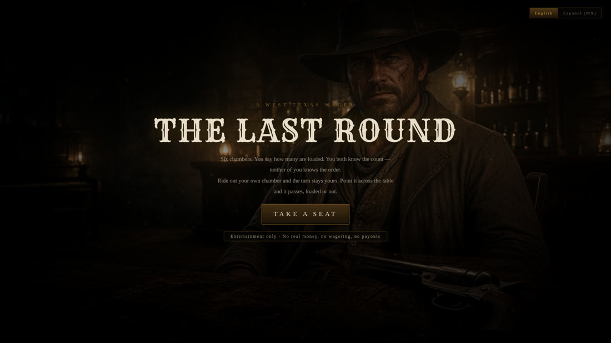
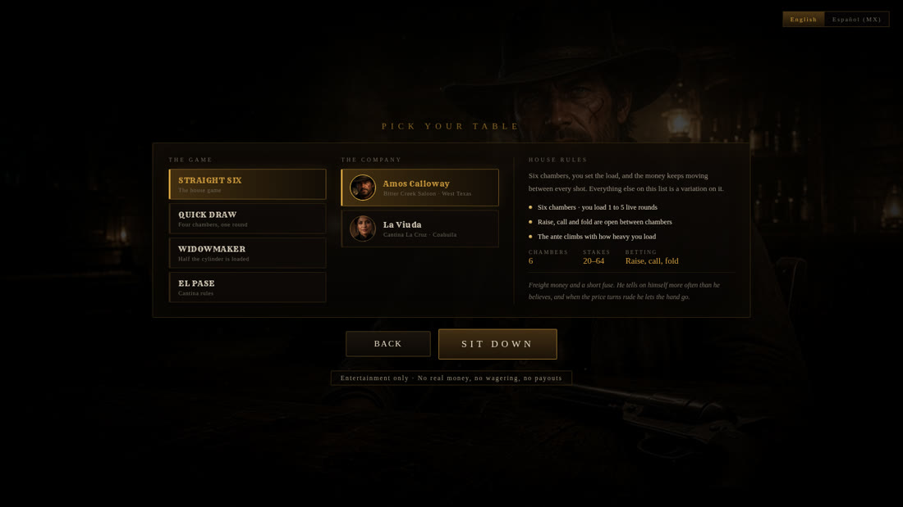
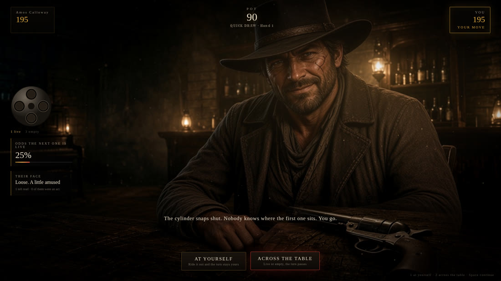
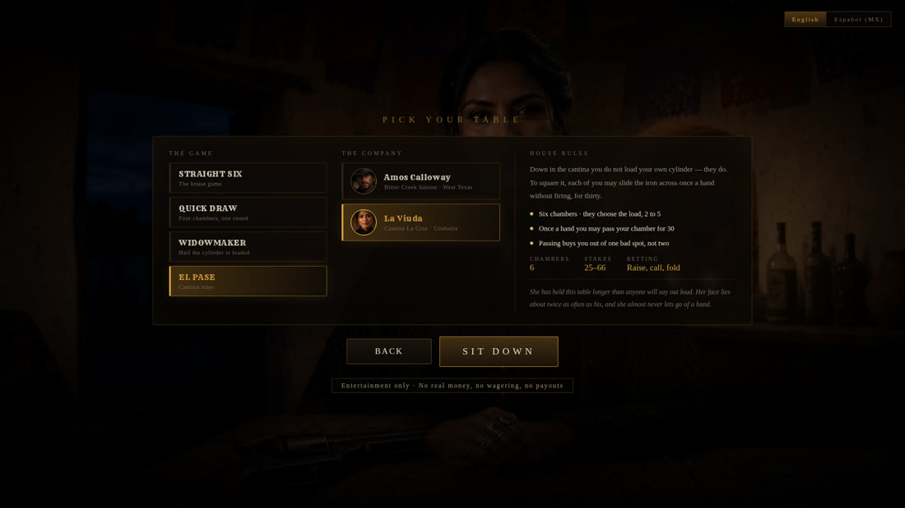
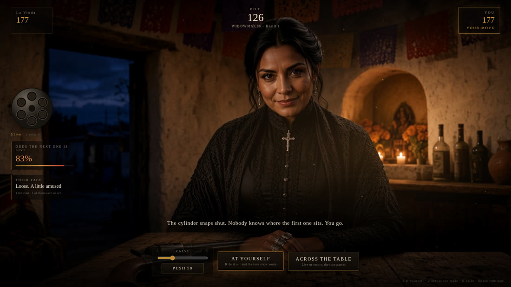
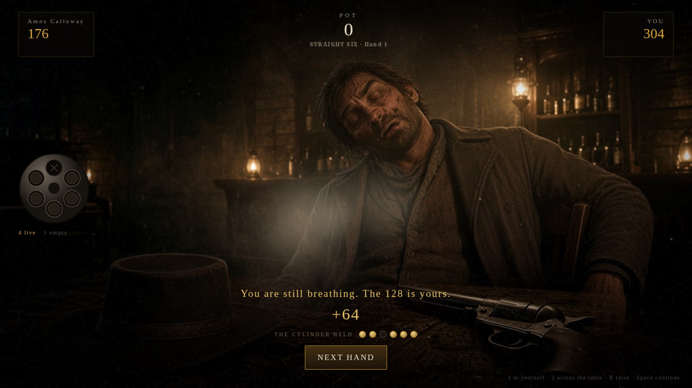

# THE LAST ROUND · LA ÚLTIMA BALA

一个网页版、西部写实风格的回合制左轮对赌游戏。

酒馆或坎蒂纳里一张木桌，对面坐着一个人，桌上一把左轮。装几发实弹、
轮流扣扳机、轮流加注，中枪的一方输掉这一局。

**纯娱乐模拟，不涉及任何真实货币、不设投注、不发奖金。** 标题页与选桌页
都明示了这一点。



---

## 现在有什么

| | |
| --- | --- |
| 玩法模式 | 4 种（规则由数据驱动，加一种是改配置不是改逻辑） |
| 对手 | 2 位，可与任意模式自由组合 |
| 场景 | 2 个（西德州酒馆 / 科阿韦拉坎蒂纳），跟着对手走 |
| 语言 | 英文（默认）+ 西班牙语 es-MX，可随时切换并记忆 |
| 角色成片 | 每位对手 6 张全幅状态图，共 12 张 |
| 引擎测试 | 30 项，含 **每种模式 120 局全自动模拟** |

---

## 四种玩法模式

选桌页把每种模式与"房规"并列，差异是写清楚的，不需要玩家自己试出来。



| 模式 | 弹巢 | 装弹 | 下注 | 独有规则 |
| --- | --- | --- | --- | --- |
| **STRAIGHT SIX**（房间的基准玩法） | 6 | 你装 1–5 发 | 加注 / 跟 / 弃 | —— |
| **QUICK DRAW** | 4 | 固定 1 发 | 只有底注 | 不能加注；所有镜头节奏 ×0.62，一局约一分钟 |
| **WIDOWMAKER** | 6 | 你装 3–5 发 | 加注 / 跟 / 弃 | 每熬过一个空仓，**双方各被强制再抽 18 进桌心** |
| **EL PASE**（坎蒂纳规则） | 6 | **对手替你装** 2–5 发 | 加注 / 跟 / 弃 | 每局每人可花 30 把枪**不开火直接推过去**一次 |

设计意图很直接：

- **QUICK DRAW** 去掉全部下注层，只剩"对己开枪抢节奏"这一条核心博弈，
  用来解决"想再来一局但不想再来五分钟"的场合。
- **WIDOWMAKER** 把"拖"变成一种输法。实弹起步就是一半，桌心还会自己长大，
  于是弃牌的代价随着时间上升，逼人早做决定。
- **EL PASE** 拿走"装弹"这个信息优势——对手替你决定风险——再用"过枪"
  这个可购买的逃生口把主动权还一部分回来。这是四种里唯一会出现
  "我明知下一发必响，但我买得起这一次"的局面。



`riskMultiplier` / `anteFor` 都是按模式内**最轻装弹量**归一的，所以
Widowmaker 装 3 发算它自己的底档，不会因为绝对数值大就凭空贵一截。

---

## 两位对手，两个场景

对手和模式是**正交**的：你可以在坎蒂纳打 Quick Draw，也可以让 Calloway
陪你玩 El Pase。场景跟着对手走，不跟着模式走。



| | Amos Calloway | La Viuda |
| --- | --- | --- |
| 场景 | Bitter Creek Saloon · 西德州 | Cantina La Cruz · 科阿韦拉 |
| 演戏概率 | 28% | 42% |
| 进攻性 | 0.55 | 0.68 |
| 胆量（多高的概率之下还肯对己开枪） | 0.50 | 0.58 |

La Viuda 更难读也更难逼退，所以她是"你已经摸清 Calloway 之后"的那一档。
角色设定刻意避开刻板印象：她是这张桌子的主人，不是背景板。



---

## 本地化

英文是唯一的事实来源，`src/i18n/strings.ts` 里 `Strings` 接口把每一条
文案都列了出来，漏翻会直接编译不过。

西班牙语不是逐字翻译，是按墨西哥北部的语感重写的：
`PASS THE IRON` → `PASAR EL FIERRO`，`FOLD` → `RETIRARSE`，
`Alive beats even` → `Vivo vale más que a mano`。
标题也不是直译（`THE LAST ROUND` / `LA ÚLTIMA BALA`）。

**引擎里已经一个字符串都不剩了。** 第一阶段 `GameState` 上挂着一个
`log: string[]`，那等于把翻译层强行塞进游戏规则里；这一阶段整个删掉，
文案全部由 UI 层持有，`engine.ts` 只吐结构化结果。

---

## 画面：在预渲染分层方案上继续加东西

关键取舍没变，仍然是**预渲染分层 2.5D**，不是实时 3D：

> 角色的每个状态都是一整张构图相同的成片，而不是抠像素材。

这一阶段在这套方案上补了三件事。

### 1. 眨眼：同一张片子的"闭眼孪生帧"

第一阶段最大的短板是"角色是静止的"。做真正的眼睑动画需要网格形变或视频循环，
成本很高；这里用的是另一条路——**以原图为参考图重绘一张只有眼睑不同的成片**，
其余构图、姿势、衣褶、灯光、颗粒全部保持一致，然后在需要眨眼时把它整张叠上去
120 毫秒再撤掉。因为两张图除了眼睛以外几乎逐像素一致，整张切换看起来就只是眨了下眼。

只给"平静"和"冷笑"两个稳定表情做了闭眼帧（每人 2 张，共 4 张）。
"惊惧"和"举枪"两种状态下不眨眼，反而更对——那种时候人本来就在瞪着。

`scripts/verify-blink.mjs` 用 MutationObserver 记录真实触发情况，实测：

```
calloway: 6 blinks in 30s
  gaps between blinks (ms): 6076, 6351, 2983, 4519, 4202
  eyes held shut (ms):      129, 136, 137, 134, 138, 129
```

间隔随机、每次闭合 120–140ms，符合真人节奏。脚本同时会导出强制睁眼／闭眼
两张眼部特写供肉眼比对。

### 2. 镜头呼吸

所有图层套同一条 6.4 秒的低幅漂移（位移 5px 以内、缩放 1.1% 以内，
**只向上缩放**所以永远不会露出画面外的安全边）。因为是同一条动画，
图层之间不会产生相对位移，静帧因此读起来像一个"端着的镜头"而不是一张照片。

### 3. 溶解不再露出空椅子

第一阶段用的是对称交叉淡入淡出。这有个当时没发现的问题：**中点时两张角色图
都在半透明附近，背后那张空房间底板就透出来了**——录屏上看就是"每次换表情，
人会从椅子上消失半秒"。

现在改成非对称：旧图先保持满不透明一拍再慢慢退（1100ms，延迟 260ms），
新图更快进来（760ms，无延迟）。全程覆盖率不低于约 97%，房间再也透不出来。

### 4. 中枪不是溶解，是借火光切镜头

两位对手各加了一张"中枪后仰倒在椅背上"的成片（帽子被打落在桌上、
硝烟浮在光里，无血无伤口）。这张图不走溶解，而是把过渡缩到 90ms，
**卡在枪口火光那一帧底下切换**——这是藏剪辑点最老的办法。



实时层（全是代码，不吃美术成本）：Canvas 尘埃与硝烟粒子、逐帧胶片颗粒、
不规则油灯闪烁（坎蒂纳换成烛光的更慢版本）、鼠标视差、开枪时的全屏过曝与镜头后坐。

---

## 音频

从"能响"升级到"有房间感"：

- **卷积混响**。程序生成冲激响应，木结构酒馆 1.25s / 衰减 3.6，
  土坯坎蒂纳 1.9s / 衰减 2.4 并带几组离散早期反射。换场景自动换房间。
- **分层枪声**：经 `tanh` 软削波的枪口爆响 + 155→30Hz 的体腔闷击 +
  1840/2470/3310Hz 的转轮金属振铃，一起送进混响。
- **程序化配乐**：酒馆是失谐立式钢琴的 A 小调乐句，坎蒂纳是弗里几亚调式的
  吉他拨弦，外加房间底噪。

仍然全部是运行时合成，没有音频文件依赖。真实采样是下一步，但现在已经不是
"合成器音效"的听感了。

---

## 玩法设计：为什么这不是又一个老虎机

主流网页 casino 游戏的问题是**玩家没有决策，只有等待结果**。这个设计的核心
是把纯运气改造成可推理、可博弈的局面。三条支柱在这一阶段完整保留并扩展：

### 1. 数量公开，顺序保密

双方都知道弹巢里装了几发实弹，但谁都不知道顺序。于是随着弹巢被消耗，
局面持续收敛：6 发里 2 实弹时下一发是 33%，打掉两个空仓后变成 50%，
到最后只剩实弹时变成 **100% 必响**。左侧的概率读数是玩家真正要算的东西。

（EL PASE 里装弹量由对手决定，但**封巢瞬间数量依然公开**——保密的永远只有顺序。）

### 2. 对己开枪换取行动权

- **对准自己**：空响则行动权仍归你；实弹则你输
- **对准他**：无论空实都换他行动

对己开枪是在用命换节奏，同时消耗空仓、把弹巢推向"必响"。谁在必响那一发
到来时**不持有**行动权，谁就赢。

EL PASE 的"过枪"是这条规则的一个受限逃生口：不开火就把枪推过去，
代价是 30 筹码进桌心，每局每人一次。它不改变上面的节奏赛跑，只是让你
能花钱买掉其中最糟的一步。

### 3. 表情会撒谎

对手每回合流露一个神色，反映他对下一发的判断——但有一定概率他在演戏
（Calloway 28%，La Viuda 42%）。界面统计"你已看过他几次表情、其中几次是演的"。

**这一条才是和老式 casino 游戏的根本区别**：技术含量来自读人，而不是拉杆。

加注 / 跟注 / 弃牌叠在上面，于是"弃牌"成了一个真实的选项——
输掉桌心的筹码，但不用碰那把枪。

---

## 已验证 / 未验证

**已经验证可用：**

- 四种模式的完整对局循环，以及模式 × 对手的任意组合
- 引擎 **30 项测试**，含 `it.each(MODE_ORDER)` 驱动的 **每种模式 120 局
  全自动模拟**，断言筹码守恒（含强制底注与过枪抽水）、每局必然终局、
  任何封弹状态下都存在合法操作
- 开枪特效逐帧实测：画面平均亮度自基线 **29.3 冲到 146.4**（约 5 倍过曝），
  逐帧运动量自基线 **0.2 跃到 110.75** 并在 11 帧内衰减 —— 火光与后坐都在
- 眨眼实测：30 秒内 6–7 次，间隔 2.4–6.4 秒，每次闭合 120–140ms
- 浏览器端实测无死锁、无 JS 报错、筹码账目正确；`tsc`、`oxlint`、`vitest` 全绿

> 关于验证方法的一点经验：用稀疏采样的录屏去判断 300ms 量级的特效**必然出错**。
> 这个项目里有两次外部复核都报告"没有枪口火光、没有镜头后坐"，而逐帧测量
> 显示两者都在，只是采样帧恰好落在了效果之外。次秒级的东西一律以
> ffmpeg 逐帧数据为准。

**明确还没做：**

- 眨眼之外的角色内部运动仍然没有（说话口型、肩部起伏、手部动作）。
  真正的商业品质这里要上视频循环、网格形变或局部 3D。
- 音效仍是程序合成，没有真实采样
- 只有两位对手；对手 AI 是参数化人格，不是学习型
- 没有服务端、没有存档、没有多人对战。发牌随机数在客户端
- 没有移动端触控适配（布局有响应式，交互节奏仍按桌面设计）

---

## 合规提醒

当前实现是**纯娱乐模拟，不涉及任何真实货币**。一旦接入真实货币投注，
它就是受监管的博彩产品，需要牌照、KYC、地域限制和经过认证的随机数发生器。
那是法务与合规问题，不是工程问题。

题材本身（俄罗斯轮盘）建议按地区评估内容分级；面向美墨市场尤其建议
在发行前做一轮本地内容审查。

---

## 运行

```bash
npm install
npm run dev
```

其他命令：

```bash
npm test     # 引擎测试，30 项，含每种模式 120 局模拟
npm run lint
npm run build
```

### 键盘操作

`1` 对准自己 · `2` 对准他 · `R` 加注 · `P` 过枪 · `F` 弃牌 · `空格` 继续／装弹

（提示条会按当前模式隐藏不适用的键。）

### 验证脚本

三个脚本都需要先跑起 `npm run dev`。

```bash
node scripts/capture-shot.mjs   # 装满实弹直到打出一枪，录页面视频供逐帧检查
node scripts/verify-blink.mjs calloway   # 眨眼触发统计 + 睁眼/闭眼眼部特写
node scripts/shots.mjs /tmp/shots        # 各模式、各语言、各场景截图
node scripts/record-demo.mjs             # 真实速率演示录像 → demo-capture/demo.webm
```

`record-demo.mjs` 直接录制页面而不是录屏：桌面录屏会把长会话时间压缩，
340ms 的枪口火光会被压成一帧、900ms 的溶解会看起来像硬切。

---

## 代码结构

```
src/
  game/
    types.ts      模式配置（ModeConfig）、回合状态机、牌局数据结构
    engine.ts     纯函数游戏逻辑（装弹、下注、开火、过枪、结算）
    ai.ts         对手人格、决策与会撒谎的表情系统
    engine.test.ts
  i18n/
    strings.ts    en（事实来源）+ es-MX，全部 UI 文案
  components/
    Scene.tsx     分层电影化画面：底板、角色状态、闭眼帧、道具、闪光、后坐
    Cylinder.tsx  弹巢读数（数量公开、顺序保密）
  fx/
    Atmosphere.tsx  Canvas 尘埃、硝烟、胶片颗粒
  audio/
    sfx.ts        卷积混响、分层枪声、程序化配乐；无音频文件依赖
  App.tsx         标题页 / 选桌页 / 牌桌，回合编排与镜头节奏
```

两条值得记住的结构约束：

- **`engine.ts` 是纯函数，不碰 React，也不含任何字符串。** 前者让它能被
  大量模拟测试覆盖，后者让本地化不必穿透游戏规则。规则差异全部收敛到
  `MODES` 这张表上。
- **游戏状态的权威副本存在 ref 里，React state 只作渲染镜像。**
  回合编排是异步的（要等动画播完），不能依赖重渲染的时序；对手由
  每次玩家操作后显式 `await pump()` 驱动，而不是靠 effect——
  后者会在"锁释放但状态没变"时死锁。
```
