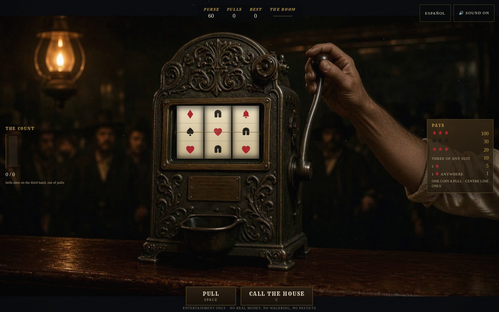
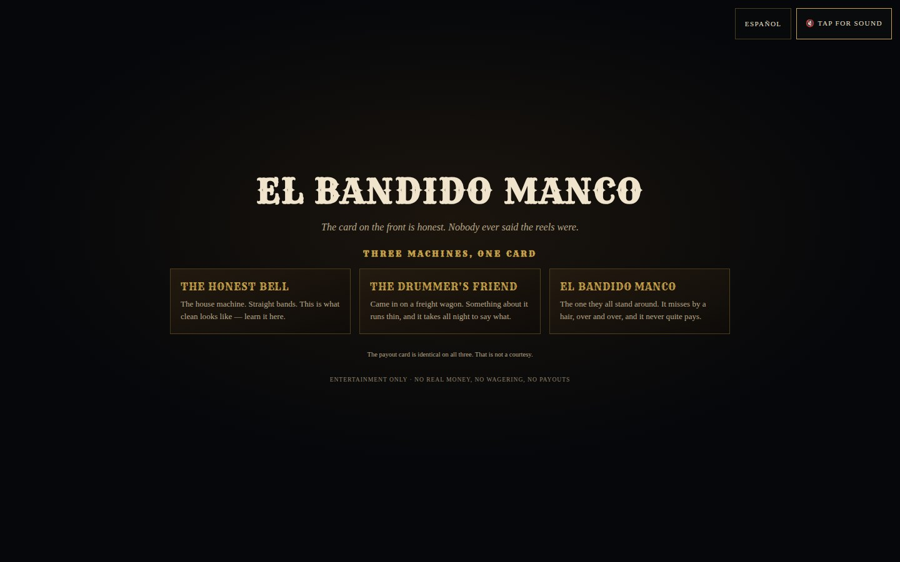
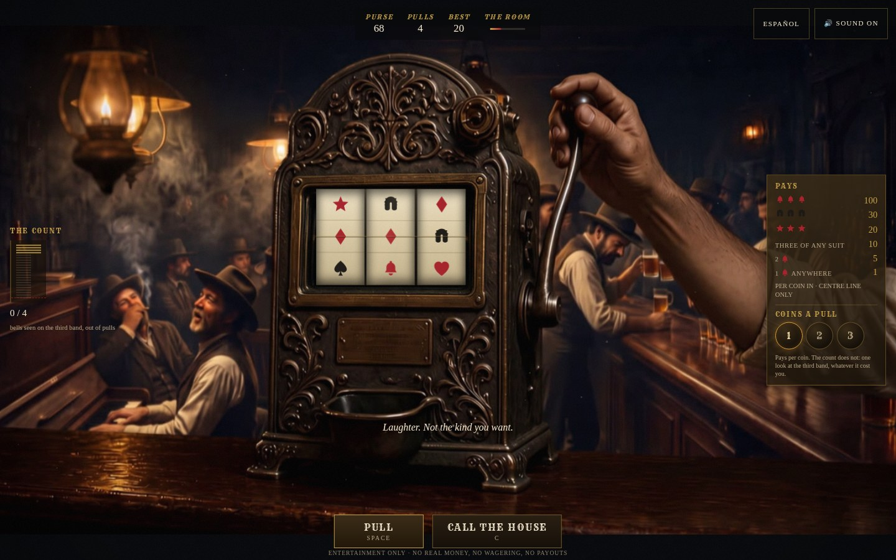
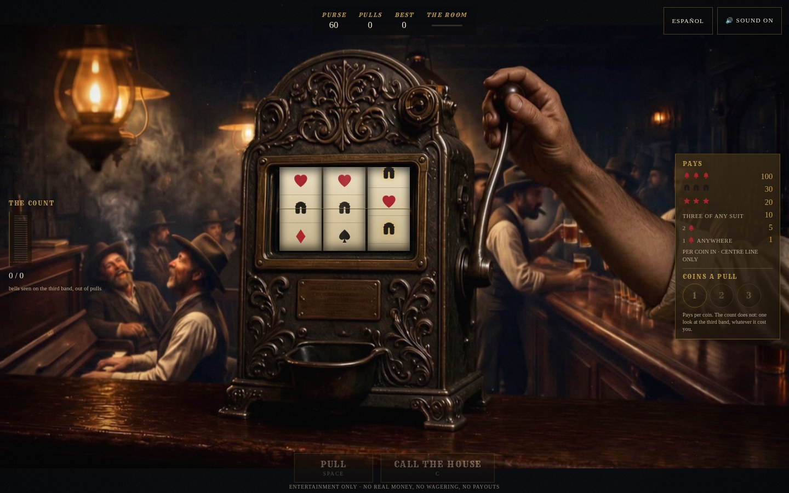
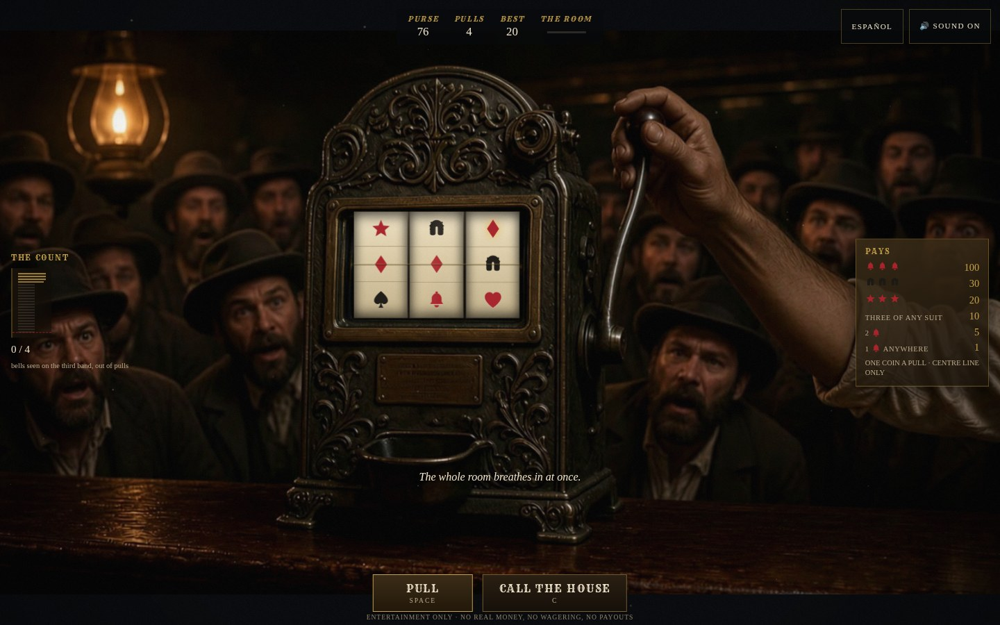
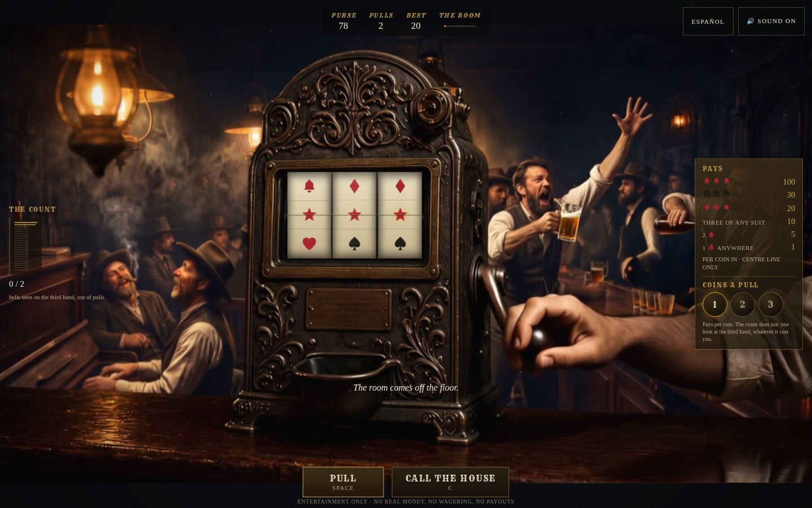
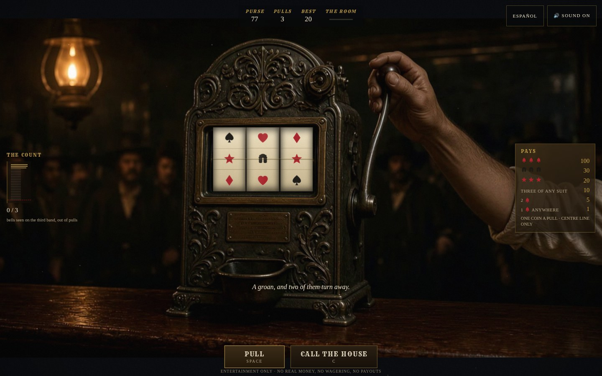
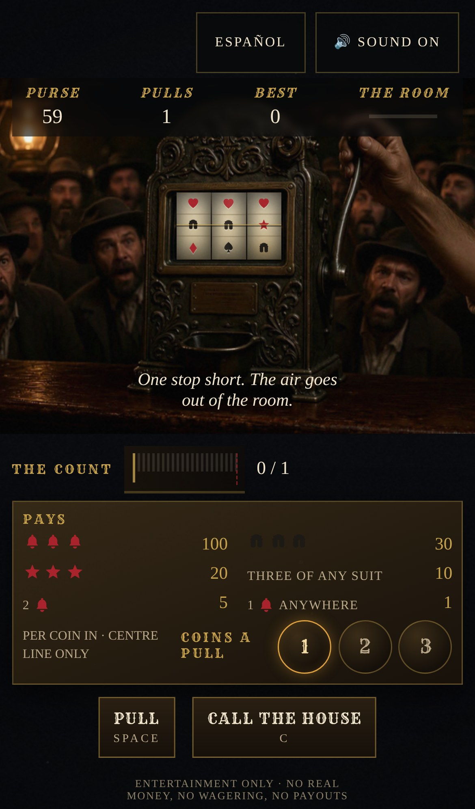

# EL BANDIDO MANCO · 独臂大盗

一个网页版、西部写实风格的老虎机游戏。1899 年的酒馆，吧台上一台铸铁三轮老虎机，
一只手搭在拉杆上，身后一屋子人围着看。**每一拉，无论输赢，那屋子人都会出声。**

它不是一个"拉杆看运气"的游戏。桌上有三台机器，面板上的赔付表一模一样，
其中两台的第三条卷带被人动过手脚。你的事情是**坐在那儿数**，数到能证明为止，
然后把它叫破。

**纯娱乐模拟，不涉及任何真实货币、不设投注、不发奖金。** 片头、选机页与台面
底部都明示了这一点。


---

## 直接试玩

预览站从这条分支自动构建（`.github/workflows/slots-preview.yml`），无需登录。

| 地址 | 说明 |
| --- | --- |
| **https://raw.githack.com/solaier2024/test/gh-pages/slots-githack/index.html** | **现在就能打开。** githack 会先弹一次 "External Content Notice"，点 "Open the page" 即进入 |
| https://solaier2024.github.io/test/slots/ | 还不能开。需要仓库管理员先在 Settings → Pages 里把 Source 选成 "Deploy from a branch" → `gh-pages` / `(root)`，之后每次推送自动更新 |

这一桌**发布到 `gh-pages` 的子目录里**，不像同系列另外两桌那样 force-push 整条分支。
Pages 只能服务一条分支，而三张桌子在同时开发——谁最后跑完谁就是整个站。
所以这条工作流是 clone 出 `gh-pages`、只替换 `slots/` 和 `slots-githack/` 再提交上去，
**跑它不会删掉邻桌**；反过来邻桌 force-push 仍然会删掉这一桌，重跑一次就回来。
彻底的修法是三条分支都改成发到子目录。

`scripts/verify-deploy.mjs <url>` 用无缓存的浏览器把部署好的站当新访客走一遍。
对着上面那个公开地址实测：

```
opening:      intro.webm, 1280px, +1.21s
title:        EL BANDIDO MANCO
disclaimer:   Entertainment only · No real money, no wagering, no payouts
machines:     THE HONEST BELL | THE DRUMMER'S FRIEND | EL BANDIDO MANCO
plates:       1 loaded, 0 broken
glass:        left 0.3477 top 0.3139 width 0.1781, bands inside: true
bands:        69 cells rendered
table clip:   idle.webm, 1280px, +1.21s
lever:        pull.webm

OK: reachable, film rolls, bands sit in the glass, every asset loads
```

它坚持两件截图看不出来的事：**片子真的在走**（读两次 `currentTime`），
以及**转轮落在玻璃里**。第二条是这一桌独有的：转轮是 DOM，从画面上挖的一个洞
里透出来，洞的位置是按 plate 的比例算的——plate 没加载、或者加载成了别的尺寸，
按钮会全都在原位，卷带却跑到吧台上去了。



---

## 现在有什么

| | |
| --- | --- |
| 机器 | 3 台，赔付表完全相同，卷带不同 |
| 每台卷带 | 3 条 × 20 停位 = **8000 种停法**，全部枚举验证过返还率 |
| 语言 | 英文（默认）+ 西班牙语 es-MX，随时切换 |
| 开场 CG | 11.5 秒四镜头片头，**全部酒馆内景**，双语字幕，可跳过 |
| 动态片段 | 9 段，桌面 / 手机两档码率 × VP9 / H.264 两种编码，外加首帧 poster |
| 生成素材 | 12 段 Kling 3 Omni image2video 源片 + 2 张 Nano Banana Pro plate，**入库**，附完整下单收据 |
| 音频 | 全部 WebAudio 运行时合成，**仓库里一个音频文件都没有**；电平在浏览器出口实测 |
| 拉杆 | **画面里那根拉杆就是你拉的那根**：拖动、有棘轮、过了离合才转 |
| 下注 | 每拉 1–3 枚。钱按枚数放大，**证据不放大** |
| 移动端 | 竖屏专用布局，44px 触控区，安全区避让，玻璃有像素下限并被检查 |
| 引擎测试 | 42 项，含 8000 停位穷举与最多 6 万次拉杆的对照模拟 |
| 验收脚本 | 9 个：类型、玻璃、窗口锁、首尾帧、**开场对位**、预算、**实际游玩**、**实际声音**、部署 |
| 交付预算 | 首屏 750 KB / 上限 2 MB；整桌 13.6 MB / 上限 40 MB。**超了构建失败** |

---

## 游戏：你数的是铃铛

赔付表最上面一行是"三个铃铛，100 枚"。**有两台机器根本付不出这一行**，
因为第三条卷带上的铃铛被剪掉了——而这件事从机器正面是看不出来的。

> 面板上的赔付表暗示三条卷带同源，那么**铃铛落在第三个窗口里**的概率应该在
> 三成上下。每一拉都是这件事的一次采样。

台面左边那条读数因此不是百分比，是**一排刻痕**，记的是**对数似然比**。
这是故意的：九拉之后的一个百分比看上去像知识，其实不是；对数似然比只有在
证据真的攒够的时候才会顶到门槛（`PROOF = 5`）。


### 三台机器（全部是量出来的）

`npm run odds` 会重新算一遍。返还率是 8000 种停位穷举，其余各列是每台机器
20 万次拉杆、200 局中位数：

| | 第三轮铃铛 | 近似奖偏置 | 返还率 | 差一格的比例 | 叫破所需拉杆 | 输光所需拉杆 |
| --- | --- | --- | --- | --- | --- | --- |
| **THE HONEST BELL** | 2 | 0 | 88.7% | 40.0% | **永远不够** | 257 |
| **THE DRUMMER'S FRIEND** | 1 | 0.35 | 78.3% | 59.0% | 63 | 201 |
| **EL BANDIDO MANCO** | 0 | 0.9 | 67.9% | 87.6% | 20 | 167 |

"永远不够"是字面意思，而且是**必须的**：干净机器上证据是负漂移的，数一整晚
也到不了门槛。少了这条，叫破就不是下注，是等待。



### 为什么不能数近似奖

近似奖是**感觉**上最有信息量的东西——第三轮停在铃铛旁边，谁都觉得不对劲。
它恰恰是最差的判据：

- 干净机器上它本来就有 **40%**（这正是它作为成瘾设计之所以好用的原因）
- 它要求"前两轮先撞上"，样本攒得极慢
- 最要命的是，偏置**从不改变赔付**——它只在中心符号相同的停位之间挪，
  所以对返还率的贡献精确为零。一个测试枚举全部 8000 种停法把它钉死在这上面。

**你数它，数的是一个不影响你输赢的东西。** 这一桌把这件事做成了玩法：
做过手脚的机器给你最多的"证据感"，和最少的证据。

### 叫破

`c` 或点 CALL THE HOUSE。这本身是一次下注，赌注是**读数**：

- 读数够了，机器确实短了 → 房间逼着庄家吐出 45 枚，这一晚结束
- 读数够了，机器是干净的 → 你被笑，罚 8 枚，热度 +0.34
- 读数不够 → 同上。**"你是对的但你证明不了"和"你是错的"在这一桌是同一件事**

热度满了就被扔出去。热度会随时间冷却，所以三次错判不会直接结束一晚。



### 下注：钱会放大，证据不会

每拉 1–3 枚，是这一桌唯一一个由玩家设定的数字。它是一个**决策**而不是一个
方差旋钮，因为钱和数数不往同一个方向走：

- **钱按枚数线性放大，庄家优势一分不动。** 赔付表是"每枚"的，所以三枚进去就是
  表上一切乘三，返还率在任何注码下都是卷带决定的那个数。**"加注把本捞回来"
  在这一桌不成立，而且是故意不成立的**——面板上那行字因此从"一拉一枚"
  改成了 `PER COIN IN`。
- **数数完全不放大。** 一拉就是**看第三个窗口一眼**，不管它花了多少钱。
  所以每拉的证据是平的，而每枚的证据被除以三。
- **于是钱包就是时钟。** `npm run odds` 跑 200 个整晚量出来的：

| | 1 枚 | 2 枚 | 3 枚 |
| --- | --- | --- | --- |
| HONEST：一晚多长 / 攒够证据 / 被扔出去 | 203 拉 / 0% / 38.0% | 107 拉 / 0% / 22.0% | 73 拉 / 0% / 13.0% |
| DRUMMER | 185 拉 / **83.5%** / 23.0% | 88 拉 / 52.0% / 13.0% | 60 拉 / **32.0%** / 7.0% |
| BANDIDO | 168 拉 / 100% / 9.5% | 80 拉 / 100% / 7.0% | 53 拉 / 100% / 2.5% |

让它成为一个值得做的选择而不是纯粹的劣招的，是**结算按这一晚实际的平均注码支付**
（`SETTLEMENT × staked / pulls`）。所以加注买的是更大的奖金和更小的拿到手的概率，
而小多少**取决于机器**——BANDIDO 二十拉就露馅，那台上加注近乎白捡；
DRUMMER 要熬大半晚才说得清哪里不对，那台上这就是全部的游戏。

平均而非"叫破时显示的注码"，否则它只会退化成最后一拉之前猛拉一把的拉杆。
`verify-play.mjs` 专门测这一条：一整晚按 2 枚打完、临叫破前跳到 3 枚，
房间照付 90 而不是 135。

> **热度不参与这件事，而且直觉是反的。** "大注引人注目"在数字里是错的：
> 注码越高一晚越短，赢的次数和叫破的次数都更少，**被扔出去反而更不容易**
> ——干净机器上从 38% 掉到 13%。两个测试把这个方向钉死了，免得以后被"修好"。

---

## 人群：这一桌的对面

二十一点那桌的对面是庄家的一张脸，左轮那桌是坐在对面的人。**这一桌没有人坐在对面**
——老虎机是一台机器，它不会读你。所以社交层整个交给围观的人，而这不是氛围装饰，
是三件具体的事：

1. **它是赔率的人肉读数。** 你在学会数数之前，先从"这屋子人叹气叹得太频繁"
   感觉到机器不对劲。
2. **它是热度的可见面。** 赢得越多、盯得越久，围着看热闹就变成围着看你。
3. **它是叫破时的陪审团。** 房间只读那排刻痕。

### 输赢都有反应，而且分两种进入方式

反应片是一个 2×2，**它的第二列是这一桌最好的东西**：

| | 从站着（`back`） | 从屏住的那口气里（`in`） |
| --- | --- | --- |
| 赢 | `roar` | `roar_held` |
| 输 | `sigh` | `sigh_held` |

前两轮撞上的时候，第三轮不按 2.85 秒停，而是吊到 **4.15 秒**，人群在这中间
压上来屏住呼吸（`lean`）。等它落下来，反应必须**从这口屏住的气里炸开或者塌下去**。

右边那一列不是锦上添花。**它是这个游戏里唯一一个"人群比玩家先知道"的时刻**，
而一段从空吧台开场的反应片，必须把已经压上来的人群一帧之内切掉才能播。
所以右列那两段是单独下单的，首帧条件在"人群前倾"那张 plate 上，中间没有剪。

| 近似奖，气还屏着 | 气塌下去了 |
| --- | --- |
|  |  |

| 三颗星 | 一次普通的输 |
| --- | --- |
|  |  |

### 静音的玩家不能因此残疾

人群的每一次反应同时走**四条通道，每一条单独都够用**：合成的人声、那段素材、
素材底下的 plate、台面上那行字。这不是保险叠保险——**在这一桌上人群的反应是信息**，
它告诉你刚才那一拉差了多少。一个静音的玩家、一个听不见的玩家、一个浏览器解不了
VP9 的玩家，读到的必须是同一局游戏。

> 有一处错误正是这条原则抓出来的。`gasp`（近似奖）曾经被接到一段永远播不出来的
> 片子上：它的 `back` 入口是死代码，因为近似奖只可能从 `in` 进来。于是在第三轮
> 落下、差一格的那一瞬间，**画面上什么都没变**，只有一行字在说话。
> `scripts/shots.mjs` 在同一次拉杆的 2.5 秒和 5.1 秒印出了同一张 plate、
> 同一段片子，这才看出来。

---

## 转轮是 DOM，不是视频

这是这个项目最重要的一条分界，`src/components/Reels.tsx` 顶上写着理由。
最诱人的做法是拍一段转轮转动的片子——一个固定机位、三个轮子在转，
生成模型正好擅长。**它在这里行不通**：

- 三条 20 停位的卷带是 8000 种结果，不可能一种结果一段片子
- 整个游戏就是玩家数铃铛落在线旁边的频率。如果那画进片子里，
  **他数的是一次剪辑，不是这台机器**，这一桌就没有游戏了
- 第三轮吊多久是运行时才决定的（取决于前两轮有没有撞上）。
  你没法预先烘焙一个还没选定的时长

所以：**视频承载定性的东西，UI 承载定量的东西。**

```
实时特效层   颗粒、烟、油灯不稳、中奖过曝        ← 逐帧响应引擎状态
转轮层       三条 DOM 卷带，引擎权威              ← 定量，这一桌的心脏
视频层       手、拉杆、人群                        ← 定性，播完即撤
兜底成片层   每段视频的首尾帧本身                  ← 首屏方案 + 弱网方案
```

转轮走的是纯函数：`positionAt(plan, rest, t)`。全速 26 停位/秒，刹车 0.62 秒走
9 个停位，用 `easeOutBack` 过冲再回弹。它只读**引擎时钟**（`performance.now()`），
所以片子卡住、解不了码、没下下来，转轮照转，第三轮照样在该停的那一毫秒停。
**片段是画面，永远不是规则。**

### 拉杆也是同一条分界

需求里要的是"一只手可以操作拉杆"，而屏幕底下一个 PULL 按钮**是让机器转起来的
办法，不是那件事**——它把玩家放到画面外面操作一个遥控器。所以画面里那颗球是
一个活的目标：按住往下拖，你拖的就是照片里那条手臂。

分界和别处一样：**片子承载定性的东西（手臂压下去只有那段素材有诚实的画面），
DOM 承载定量的东西（你的手拖到哪儿了，这是任何片段都不可能知道的实时量）。**
所以 DOM 只画一个跟着指尖走的圆环，每 9 度一个棘轮齿；手臂交给 `pull.webm`。
拿两张 plate 去插值那条手臂是另一个选项，结果读起来像二次曝光而不是运动——
两张里的手臂位置差太远，交叉淡入只会让你同时看见两条。

几何写在 `src/machine.ts`：一个支点加上两张 plate 上量出来的静止/到底角度与半径。
`gripAtTop()` 用二分法反解，因为**行程和竖直拖动距离不成正比**——不反解的话
圆环会跑到手指旁边去。过了 38% 的行程就离合，和真家伙一样：过了这个点手臂
不再是你的，松手也没用。

底下那个按钮留着。拖动需要指针和一块够大的画面，键盘、读屏软件和竖屏手机
三样都没有，**所以拉杆是好的那种玩法，永远不是唯一那种**。轻点那颗球也算。

### 玻璃这条缝

转轮是 DOM 铺在画面上，从机器面板上那个洞里透出来。洞的位置写在 `src/machine.ts`，
以 plate 的比例表示：

```ts
export const WINDOW = { left: 0.3477, top: 0.3139, width: 0.1781, height: 0.2028 }
```

**这是整个项目里唯一一个两个工种必须达成一致的数字**，所以它有一个专门的检查：
`scripts/verify-window.mjs` 在每一张配准过的 plate 上把玻璃量一遍，
比例漂了就让构建失败。这条缝不会悄悄烂掉。

---

## 视频层：换成了生成式视频

同系列前两桌的 `morph(a, b, steps)` 是 ffmpeg `minterpolate` 稠密光流。
这一桌把它换掉了——换的**只有那一个函数的实现**：

```
morph(a, b, steps)  ──┬─→  Kling 3 Omni image2video（OpenArt MCP）  ← 新主路径
                      └─→  ffmpeg minterpolate 光流                  ← 保留为兜底
```

缝两边一行没改：重定时的 resample、内容 digest 缓存、`frames.length !== steps + 1`
的断言、`normalised()`、双编码、全部 verify 脚本。**没有生成素材的 checkout
仍然能构建出一张能玩的桌子**，因为光流那条路还在。

关于"这个系列该不该改用 OpenArt"的完整评估（包括**动手之前的评估为什么错了**），
在 [`../SLOTS.md`](../SLOTS.md) 第四节。

### 模型是量出来的，不是挑的

同一对 plate、同一段 prompt，`scripts/measure-drift.mjs` 逐帧量：

| | 最大位移 | 平均残差 | 源分辨率 | credits |
| --- | --- | --- | --- | --- |
| PixVerse V6 | 4px | 5.02 | 720p | 50 |
| Kling 3 Omni | **2px** | 4.97 | 1080p | 175 |

**位移是那一列真正重要的**：转轮窗口是画面上挖的一个洞，机器飘就是卷带漏边。

### 首尾两帧都锁在已批准的 plate 上

VIDEO.md 第六节要求锁首帧，这里**首尾都锁**，因为 `Scene.tsx` 会在引擎选定的
那一刻把片子撤掉、露出底下的 plate。一段结束在别处的片子，撤掉的那一帧就是跳帧。

`scripts/verify-identity.mjs` 把这条做成了检查——逐段解出首尾帧，和它被下单时
指定的 plate 逐像素比：

```
clip            end             plate             casting    whole
pull            first           machine_rest         3.82     2.96
roar_held       first           machine_lean         5.17     3.44
sigh_held       last            machine_sigh         1.34     1.00
...
OK: every clip starts and ends on the plate it was ordered to
```

两个数字量的是两件不同的事，而**搞清楚这一点花了一轮返工**：
`casting` 只看机器那一块，所有 plate 里的机器是一模一样的，
所以它**分不出**是哪张 plate，它只能说明配准锁还在（门槛 8）。
`whole` 看整幅，人群是唯一的差别，所以它才是身份（门槛 5）。
最初我写的注释说反了，然后去量：`sigh` 从 `lean` 起手的 casting 是 7.97，
**低于门槛 8——也就是说那个接错线的场景根本不会被抓到**。注释按实测重写了。

### 素材入库，因为那是收据不是配方

生成模型不确定，种子也不归我们。`clipsrc/generated.json` 记的是**怎么下的单**：
模型、模式、两张条件 plate、完整 prompt、historyId、URL。照着它重下一单会得到
另一段片子。所以那 12 段 mp4 是源资产，和手画的 plate 同级，进版本库。

存 1280×720 而不是模型返回的 1920×1080：前者是整条流水线的工作尺寸，
更高的细节会被第一个 scale 滤镜丢掉——**为构建过程扔掉的细节付版本库的钱，
等于存了收据没存货**。

### 片段清单

| 片段 | 帧数 | 时长 | 何时播 |
| --- | --- | --- | --- |
| `idle` | 124 | 4.13s | 台面空闲循环：油灯起落、烟、后面的人换重心 |
| `pull` | 12 | 0.40s | 手把拉杆压到底 |
| `release` | 16 | 0.53s | 拉杆弹回 |
| `lean` | 46 | 1.53s | 前两轮撞上，人群压上来屏住呼吸 |
| `roar` / `sigh` | 52 / 58 | 1.73s / 1.93s | 从站着炸开 / 塌下去 |
| `roar_held` / `sigh_held` | 48 / 58 | 1.60s / 1.93s | **从屏住的那口气里**炸开 / 塌下去 |
| `intro` | 276 | 11.50s | 开场，24fps，四镜全部在酒馆里 |

每段出 1280×720 与 768×432 两档 × VP9 / H.264 两种编码，外加 poster 首帧。

---

## 开场：四个镜头，全部在酒馆里面

台面上一切都是固定机位，因为 DOM 必须和画面保持配准。**开场没有东西叠在上面，
所以它可以是一台摄影机而不是一张 plate**——这也是它们是唯一没有 `to` 的片段的原因：
一个正在走的镜头，不能被要求停回它出发的地方。

**热闹的吧台** → **满屋子人，尽头那一圈不说话的** → **工作台上那条卷带**
（一个铃铛被刀片挖了下来，躺在胶罐旁边）→ **机器，和已经搭上拉杆的手**。

### 原来第一镜在街上，那是错的

原版的开场从**屋外**起手：夜里的边境小镇，一扇门里透出暖光，镜头往里推。
它是整个项目里最好看的一个镜头，而它是**错的第一镜**：

> 这一桌讲的全部是**一屋子人**，以及他们在你赢了输了之后做什么。
> **而一栏房子不会吵。** 一扇你还没走进去的门里，没有人群。

现在它从里面开始，而且是一晚上最闹的那个钟点。第一镜是吧台：二十来个人三层挤在
黄铜杆前面说话，酒保往一排小酒杯里倒酒，有人笑得仰过去，角落那架立式钢琴有人在弹，
灯梁里全是烟。这同时是一份**清单**——`crowd.ts` 合成的十个说话的人、杯子、酒瓶、
倒酒、靴子、椅子、咳嗽、屋子那头的笑声，现在画面里逐个都能指出来。
**声音里有的东西，画面终于把它们的出处交代了。**

第二镜为同一个原因重拍。它原来穿过的是一间**空屋子**——prompt 里写的是
"past abandoned card tables and an empty faro layout"——屋子是死的，
而这恰好是这一桌最不想要的东西。现在它是一间满的屋子，**里面只有一圈人是静的**，
围在尽头那台被照亮的机器旁边。这才是这一镜真正要说的话，
**而它只有在屋子里其他一切都在动的时候才成立。**

机器那一镜从第三挪到了**最后**，因为开场之后那一屏问的就是"你要哪台机器"，
而一段开场的最后一个镜头，就是玩家拿到操作权那一刻还在看的东西。
字幕跟着重写成一条完整的论证：屋子很吵 → 最安静的人在尽头 →
**赔率从来不印在正面，它贴在卷带上** → 所以你读不了它的脸，**你只能数**。

**第三镜是这段开场存在的理由。** 它不靠任何教程，把玩家的注意力从赔付表挪到
卷带上，而那就是整个游戏。它也是唯一一个没有条件末帧的镜头——收在别处正是它要的。

最后那一镜反过来，首尾都条件在 `machine_rest` 上：**它不是为了接住下一刀
（后面没有刀了），是为了让开场里的那台机器和玩家等会儿要坐下来面对的那台是同一台。**
一个正在推的镜头如果不锁住终点，推完就漂到别的铸件上去了。

四个接点里只有第一个是叠化，另外两个是**硬切**，因为卷带那一镜的尺度和它两边的
全景完全不是一个量级：把全景叠进微距，看上去是屋子化成了一条纸；再叠出来，
是纸化成了铸铁。切进细节再切出来是更对的语法，
**也是让那条卷带读起来像"另一个地方"而不是像一个转场特效的唯一办法。**

`prefers-reduced-motion` 的人直接进选机页。

### 两张 plate 是量出来的，不是挑出来的

两张新 plate 都是 OpenArt 的 Nano Banana Pro image2image，条件图是**已批准的旧
plate**（旧的屋子 plate 保住了机位和尽头那盏灯，`machine_rest` 保住了光的调子），
收据在 `clipsrc/generated.json` 里。吧台那张回来了三个候选，选的那个不是看着最顺眼
的，是**和台面最接近的**：

| | 平均亮度 | 暖偏（R−B） |
| --- | --- | --- |
| 已批准的 `machine_rest` | 17.7 | **+13.9** |
| 采用的吧台 plate | 31.8 | **+13.2** |
| 弃用 A | 37.5 | +18.4 |
| 弃用 B | 45.6 | +31.0 |
| 第一批（另一条 prompt） | 47.8 | +7.3 |

顺带落下来一件本来没打算要的东西：**这段片子现在是越走越暗的**——
吧台 31.8 → 屋子 24.2 → 机器 17.7。开场从一屋子人收到一台机器上，
亮度跟着收，而这三个数不是调的，是三张 plate 各自量出来的。

### `verify:opening`：问片子本身，每句字幕落在哪一镜上

`Intro.tsx` 一直声称"字幕按片长的**比例**定位而不是按秒，所以重剪片头不会把台词
甩到错误的镜头上"。这句话**对算术是成立的，对片子什么都没说**，而且没有任何东西在量它。
镜头长度取决于模型交回来多长，接点是一个叠化加两个长度不同的硬切，
running order 是 `build-clips.mjs` 里的一个数组——**这三样里任何一样动一下，
都会在不碰字幕表的情况下把边界移走。**

而这件事真的发生了。开场重剪之后，这个脚本第一次跑就抓到两句字幕压在新接点上：
**第三句比卷带早出来 0.2 秒，第四句比机器早出来 0.75 秒**，两句都会照原样发出去。
项目里另有两处注释在上一个版本里就已经把"第三镜是哪一镜"说错了，同一个原因：
**从来没有东西必须跟片子对上。**

**它不去找剪切点。** 硬切是帧差的一个尖峰，叠化不是，而一段穿过人群的慢推轨自己
就会产生帧差——能把这三者分开的那个阈值，只在调它的那条片子上成立。
所以它换了个问法：每一镜的**源素材都还在磁盘上**，于是"第 t 秒屏幕上是哪一镜"
可以直接问——把这一帧和四段素材逐帧比，看它是从哪一段里出来的。

这也比它的第一版（拿四张静态 plate 比）锋利得多。两个全景是同一间酒馆的两个拍法，
而推轨走到一半，那一帧**真的已经离开它出发的那张静帧**了：

| | 正确的那个 | 次近的 | 倍数 |
| --- | --- | --- | --- |
| 比静态 plate | 19.6 | 22.8 | **1.16** |
| 比源素材 | 1.1 | 20.6 | **18.30** |

**两个排序都是对的，值得断言的只有一个。** 1.16 倍是一句关于抛硬币的真话；
换成源素材，同一句话背后有十八倍，而且**没有为此选过任何阈值**。
没有生成素材的 checkout 仍然走 plate 那条路（那张桌子必须还能构建），
在那条路上它只断言身份、报出倍数但不设下限，**并且把用的是哪种参照打印出来**，
所以两条路证明的强度不同这件事是看得见的，不是心里有数。

每句字幕在它**亮着的那段时间里采三个点**（前 30%、中间、后 70%），
因为一句只压到接点一头的字幕，只看中点是看不出来的：

```
276 frames, 11.50s at 24fps, against the source takes

caption      at       bar    room    band machine   reads as  margin
1          1.25s       1.4    16.2    34.0    22.4        bar    12.0
1          1.63s       1.3    18.0    34.2    23.0        bar    14.4
1          1.96s       1.2    18.7    34.3    23.3        bar    15.4
2          3.79s      19.0     1.1    36.1    21.6       room    17.7
2          4.25s      20.6     1.1    37.6    23.4       room    18.3
2          4.67s      21.1     1.2    36.8    22.0       room    17.7
3          6.42s      35.0    38.5     1.0    37.3       band    34.2
3          6.92s      34.4    37.9     1.1    37.3       band    29.9
3          7.42s      34.5    37.5     1.1    37.4       band    32.5
4          9.08s      23.4    19.9    34.5     1.1    machine    17.6
4          9.42s      23.4    19.9    34.5     1.1    machine    17.6
4          9.71s      23.4    19.9    34.5     1.1    machine    17.6
title     10.88s      23.4    19.9    34.5     1.1    machine    17.6

OK: 4 shots, all of them inside the saloon, each caption on the shot it was
    written for, and the film ends on the machine
```

它跑 1.3 秒，离线、不需要浏览器，所以**它在 CI 里**——和预算检查同一类：
读的是已经编码好的交付产物，而那正是会悄悄腐坏的东西。

---

## 交付预算是会让构建失败的

VIDEO.md 第七节的那句"超了就判失败，不靠自觉"在这里是 `npm run verify:budget`：

```
first screen (budget 2 MB)
  art/machine_rest.jpg       70 KB
  intro.sm.webm             335 KB
  pull.sm.webm              126 KB
  release.sm.webm           120 KB
  idle.sm.webm               90 KB
  TOTAL                     741 KB

whole table, every encode and size (budget 40 MB)
  13.3 MB

OK: within the delivery budget
```

### 它第二次开口，是因为画面里多了一群人

mp4 那一路本来是**按质量**编码的，旁边留了一句注释：x264 在这些 CRF 上自己就落在
所有预算以内，哪天不成立了 `verify-budget.mjs` 会在发出去之前说话。

**它不成立了，而脚本真的说了话。** 把开场的空街和空屋子换成二十个动着的人之后，
`intro.sm.mp4` 从 367 KB 涨到 **484 KB**，上限 400 KB；而它旁边那个**本来就按预算
编码**的 webm 落在 335 KB，**什么都没察觉到**。

> **一个质量目标是关于画面看起来怎么样的承诺，对它要花多少字节不作任何承诺。**
> 而一张有人群的画，比一张街的画贵。

所以现在**有预算的片段，两种编码都按预算走**同一条两遍路径。350 KB 手机 /
1358 KB 桌面。那几个写下来的上限重新变成了这个仓库的属性，
而不是"这一镜恰好有多忙"的属性。

### 一个反直觉的结果：真素材反而更大

把开场从 Ken Burns 裁切换成真实推轨之后，`intro.sm.webm` 从 726 KB 涨到
**1410 KB**，上限是 400 KB。我当时的假设是"真运动比合成裁切更好压"，
**这个假设错了，而且错了一倍**。

原因是**视差就是被遮住的东西正在露出来**——每一帧都是真正的新信息；
而一个裁切是对编码器已经见过的东西再裁一刀。所以开场改成**按码率下预算**
的两遍编码（260 kbps），而不是按 CRF 下质量：

| | 大小 | SSIM |
| --- | --- | --- |
| CRF 45 | 100% | 0.8479 |
| 两遍 260k | **62%** | **0.8482** |

开场另外单独按 **24fps** 编码（其余全是 30）。源就是 24，重采样到 30 会在
每 12 帧里复制 2 帧，而这恰好在慢推轨上最明显。

---

## 音频：一个音频文件都没有

全部 WebAudio 运行时合成。没有需要署名的第三方素材，也不存在授权风险。

### 片头是一部默片，而这一点这份文件里的每一条检查都看不见

游戏的第一个声音应该是开场那十一秒半：吧台前挤了三层人、角落里有人在弹琴。
**它是无声的。** 不是"声音小"，是一条音轨都没有，直到你坐到机台前才有声音。

每一段片子在这个项目里**按设计都是无声的**——烙进视频里的房间声没法在停轮的
时候让开、没法随夜色变浓、也没法在有人叫破的一瞬间死寂——所以片头的配乐
本来就该是**底下活着的那个酒馆**。这件事是接好了的，而它没有发生：

- `Intro.tsx` 里那个 effect **只启动了乐队，没启动房间**；
- 而乐队当时**把第一首曲子往后推 6–16 秒**，比整部片子还长。

两半都修了：房间在这里就开始（密度按"最热闹的那个钟点"给，因为第一个镜头
拍的就是那个），乐队**开场直接从一首曲子的中间进来**。两个函数都是幂等的，
所以后面坐到机台前不会再开第二个酒馆，也因此**片子和赌桌之间声音不会断一下**。

**而这份文件里原来一条检查都碰不到它，原因是结构性的而不是微妙的**：
`verify-audio.mjs` 里每一节的第一件事都是**跳过片头**，因为每一节都是在讲
赌桌。所以片头现在有自己的一页（不种"看过"标记），而这一节的每一个读数都是
**在 video 元素还在屏幕上的时候**量的——窗口两头都断言一次，
这样"片子已经交接给选机台那一屏之后"量到的读数就不可能冒充"片子放着的时候"。

```
ok    the film is still on screen while it is measured   1 video element(s), then still there
ok    the opening has a soundtrack at all                -48.1 dBFS average under the film
ok    and what plays under it is the room, not the band  room -47.4 against a band of -60.2 dBFS
ok    and the conversation is running under it           -47.2 dBFS of talking
ok    and it is the room the film opened on              -47.4 dBFS under the film against -46.1 at the table
```

三句话分别是：**有音轨**、**底下放的是那间屋子而不是一段配乐**、
以及**交谈确实在跑**。第三条才是"缺的那一半"而不是"小的那一半"：
`startRoom()` 才是建起交谈总线的那个函数，所以要是片头继续只启动乐队，
`__layers` 连这条总线都**找不到**。最后一条把两边缝起来：从片子走到赌桌，
不该听起来像走进了另一栋楼。

### 这一桌的声音是"酒馆 + 机器"，不是配乐

**先说清楚层级，因为这是一个会被测量、也确实被测量过的判断，不是口味问题：**

```
                                          实测（空台中位数 / 一次拉杆）
  酒馆环境      十个人在说话 + 杯子、酒瓶、倒酒、靴子、
                椅子、咳嗽、街门、屋子那头的笑声           -46.6 dBFS  ┐ 主
  机台自己      拉杆棘轮、卷带咔哒、停轮、落币、铃铛         -27.4 dBFS  ┘
  观众反应      头奖那一下                                 -23.3 dBFS  （最响）
                其余每一把（赢/输/屏息/哄笑）          -31.4…-37.0 dBFS （在机台之下）
  ── 以上是"房间"，以下是家具 ──
  角落那支小乐队（而且大半时间根本不响）                    -56.0 dBFS
```

（酒馆和乐队是**电平**，所以是均值；机台和反应是**事件**，所以是峰值——
为什么必须这样分，见下面"同一把橡皮尺，量到第三次"。）

**反应那一栏为什么劈成两行，见下面"每一把都炸场"**——这是这一版改掉的三个
硬伤之一：原来它是一行，从头奖到平局全挤在 5dB 以内。

**这个层级一度是反的。** 逐条总线量出来：钢琴 -35.8，而整个环境声 -39.8——
也就是说空台上最响的东西是那架钢琴，**这是"一段配乐，背景放着个酒馆"，
不是"一个酒馆，角落里有人在弹琴"**。而且这件事在混音的任何一个单独的数字里
都看不出来，只有把总线分开量才会暴露：destination 上它们已经加在一起了。

三处改动：

1. **环境声是人，不是噪声。** 见下一节——这是整份音频里最花功夫、也最容易
   糊弄过去的一件事，而且它**修好之后又坏了一次，坏成了另一个样子**。
   杯子、酒瓶、倒酒、靴子、椅子、咳嗽、街门由 `clatter()`
   每隔 0.62–2.1 秒挑一件出声，屋子那头的笑声每 9–25 秒一次。
   **这也是让环境声"顶在前面"而不必把噪声开大的原因**——嗡鸣开到能主导混音
   就只是底噪，而有玻璃器皿的屋子在低得多的电平上就已经听起来很忙。
2. **乐队不弹循环，它弹曲子。** 也见下一节。总线电平 0.125、低通 2600Hz，
   一首弹完停 5–12 秒，**所以大半个晚上它是不在的**。
3. **机台声一个没动**，它本来就在最前面。

总线都由 `main.tsx` 交给脚本，`verify:audio` 逐条量并且把顺序钉死：

```
ok    an idle table is the saloon, not the piano    the room -46.1 dBFS against an upright that reaches -56.0 while it plays
ok    and it is a room rather than a hum            11.0dB between the loudest thing in it and its average
ok    the machine leads while it is working         -27.4 dBFS against an idle saloon of -46.1
ok    and the upright is behind both of them        upright -57.7, saloon -46.1, machine -42.6 dBFS
```

第二条是防一种偷懒的：把底噪开大也能让"环境声最响"这一条通过，但那不是一间
屋子，是嘶声。**峰值和均值之间拉开的那段距离，就是"屋子里有事情在发生"的数值形式。**

#### 同一把橡皮尺，量到第三次

这四条里的第一条**在部署环境上挂过**，而挂的时候混音一点问题都没有：
公开地址上量到房间 -40.0、钢琴 -44.0，差 4.0，门槛是"大于 4"；
**同一份构建在本地是 -33.4 对 -44.5。** 房间那一侧在两台机器之间差了 6.6dB，
钢琴那一侧没动。

这正是这份文件下面早就写过的那件事，只是当时只修了一处：
**峰值保持对一间有稀疏瞬态的屋子来说是一个极值，不是一个电平。**
杯子、靴子、椅子哪几件恰好落进这个窗口，就决定了读数。所以房间改成按**均值**量。

而钢琴那一侧有它自己的陷阱，**并且方向相反**：它现在是弹一首停十四到四十二秒，
所以窗口只要长到读数稳定，量到的大半是它不响的那段时间——
**拿房间去比那个数，钢琴开多大都能过。** 所以钢琴量的是"它正在弹的时候有多响"
（`__watchPiano` 本来就分得清这两个状态，门槛是绝对的 -80dBFS，两边各有 20dB 余量）。

"机台压过房间"那一条也跟着改了，但改的方向**反过来**：一次拉杆是**事件**
（棘轮、三次停轮、落币），用均值量，七秒里大半是房间，读出来只有 -44.8 对 -48.4；
用峰值量是 -25.1 对 -48.4，**22dB，而且换机器只差一个 dB**，
因为那是机器被设计出来能发出的最响的声音，不是哪只杯子碰巧落在窗口里。

> **两侧各用哪把尺子，取决于那一侧是电平还是事件，不取决于统一好看。**
> 电平用均值（会收敛），事件用峰值（不收敛，但它就是那件事本身）；
> 而"某个事件盖不盖得住房间"从来就是**峰值比均值**。

改完之后同一份构建在两台机器上读出来的数是这样的——**这就是"混音没问题，
是尺子有问题"的证明**，因为混音一行没动：

| （那一版角落里还是一架独奏钢琴） | 房间 | 钢琴（正在弹） | 机台 |
| --- | --- | --- | --- |
| 本地 | -47.2 | -56.4 | -25.1 |
| CI | -47.0 | -56.1 | -25.0 |
| 改之前这两处差多少 | **6.6dB** | 0.5dB | — |

### 但"有事件"还不够：环境声必须是人声，而这四条检查都测不出来

用户听完第一版的评价是两句话：**背景音乐换掉；酒馆的嘈杂声不能是白噪／粉噪
底噪，要做成可辨认的氛围声——人声交谈、杯子碰撞、脚步、远处笑声。**

第二句话指的东西，**上面那四条检查一条都拦不住，而且它们当时全是绿的。**
原来的底噪是 520Hz 带通噪声 + 0.23Hz 慢抖 + 偶尔丢一个音节上去。它的电平对、
层级对、峰均差也对（杯子和靴子撑起来的），**唯一的问题是它不是人**。
而"是不是人"这件事，**电平、频谱、峰均差三个都答不了**：

> 一群人说话和一段带通噪声，**长时平均频谱几乎一样**。这就是噪声床能当环境声
> 用的原因，也是它在这里混过去这么久的原因。

**#### 把嗡鸣换成真的在说话，然后它变成了外星人**

第一版的修法是给每个说话的人配一张嘴：一个锯齿波（喉咙）穿过**两个在六个元音
之间滑动**的共振峰，套一个音节门，**一半的音节前面还甩一段 20ms 的擦音当辅音**，
六个人，句子之间停 0.45–3.6 秒。

**这份文件里每一条检查都因此变绿了，而它听起来像外星人在说话。**
用户玩完的原话是"像外星人乱说话"，而这句话本身就是完整的诊断：

> **隔着一间屋子的人群，不是"一个你听不懂的声音"，是"一个你跟不住的声音"。**
> 只要有一条嗓子是可追踪的，耳朵就会开始听词；而这里面根本没有语言，
> 于是**"没有词"就成了整个混音里最响的东西**。

让一条嗓子变成可追踪的，有四件事，现在四件都拆了：

| | 之前 | 现在 | 为什么 |
| --- | --- | --- | --- |
| 辅音 | 一半音节前面 20ms 擦音 | **删** | 元音前面一段嘶声，耳朵听成"他在试着说一个词"。隔十米的真人也不会有辅音传过来 |
| 共振峰 | F1/F2 每 150ms 在六个元音之间跳 | **一人一个元音色**，只抖 ±4% | 每 150ms 换元音就是在**咬字**。现在一句话里变的是音高和音量——那才是能跨过一屋子传过来的东西 |
| 可辨带 | 低通 2200Hz | 低通 **1500→700Hz** | 言语之所以能被辨认成言语，靠的是 1–4kHz；而十米空气和一屋子人正好先拿走这一段。这是声学在做声学该做的事 |
| 人数和停顿 | 6 人，停 0.45–**3.6** 秒 | **10 人**，停 0.25–**1.9** 秒 | 这条不是"每个人"的属性，而它最关键：六个人加长停顿，大半时间屋里只有一条嗓子在响，**而一条独唱就是那个外星人** |

现在同时有五六个人在说话，**没有哪一句是跟得住的**。

保下来的恰恰是可以被测量的那条性质：**合成出来的整体仍然按音节率开合**，
所以它还是人，不是嘶声。只是变成了**听不出在说什么的人**。

- **音节率**：一秒 4–7 个。这是嘴能动的速度，不是随便挑的数。
- **语调下降**：一句话从头到尾音高掉大约一个五度（偶尔 18% 的概率反过来上扬，
  那是在问话）。没有这条就是和尚念经。
- **音节门的边沿**从 11/18ms 放宽到 35ms 两头。11ms 的开合是一个**辅音边界**；
  35ms 是一张已经张开的嘴在改变它在做的事，**这是"数得出音节"和"糊成一片"
  之间的差别**。
- **没有人站在 far = 0**。这几个镜头里你身边没有人，而**近场的那一条嗓子
  就是又可以被追踪的那一条**。

**实现上刻意做得很便宜**：节点每人只建一次并活满整场，一个音节是几条加在
**已有参数**上的自动化，不是几个新节点。十个人一共约八十个节点，页面在录屏器
底下仍然跑满 30fps——"一个音节建一次声音"的版本做不到。

**#### 背景音乐：从一个循环改成一首一首的曲子**

原来是 G 调 I–VI7–II7–V7 四小节回旋，**开桌到关桌一直转**。这里每一条都说得过去，
除了最要紧的那条:

> **一个循环没有开头也没有结尾，而一个没有开头也没有结尾的东西就是配乐。**
> 你没法走进一间正放到循环中间的酒馆。你可以走进一间正弹到半首华尔兹的酒馆。

现在它弹**曲子**：一首是 C 大调三拍华尔兹，带 1890 年代最标志性的那一个
**小调下属**（第 12 小节是 Fm6 而不是又一个 F）；另一首是 A 小调、慢一些、
更靠属和弦。十六小节，有终止式，最后两小节**真的渐慢**——那是告诉人
"这首弹完了"而不是"声音淡出去了"的唯一线索。

左手是 oom-pah-pah（重音在一拍，和弦答在二三拍），这是"有个人在弹"而不是
"有个节奏组在走"的声音；每小节速度随机浮动百分之一二。琴本身也换了：
**每个音双弦、彼此差几个音分**——这才是 honky-tonk 这个词的字面意思，也是
酒吧钢琴听起来像酒吧钢琴的主要原因。

**#### 然后一个人弹的琴变成了一支小乐队**

用户玩完的第二句话是：酒馆要**热闹**，要能垫住一屋子人的**可跳舞曲**。
而上面那两首——华尔兹和那支慢的——**都是三拍子，都慢**，没有一首是能
把靴子跟着往地板上敲的。

所以角落里现在有四样东西：

```
  钢琴     双弦 honky-tonk，和弦落在反拍
  五弦琴   泛音故意做"不准"（1, 2.01, 3.02, 4.05, 5.1 倍），
           每个泛音衰减不同，> 0.5 的"脆度"再加一段 20ms 的指甲声
  低音     拨弦，一拍一个，跟着和弦根音走
  一只靴子 低通到 240–330Hz 的噪声，每小节最后一拍跺一下
```

曲目表是 `[两步舞, 华尔兹, 两步舞, 挽歌]`——**两步舞出现的次数是每支
华尔兹的两倍**。两步舞是 D 大调、二四拍、104 bpm、十六小节 D–A7–G，
配一条 29 个音的调子。编曲**按拍型分派**：华尔兹还是"一拍低音、二三拍和弦"，
两步舞是"正拍低音 + 反拍和弦和五弦琴 + 每小节末尾一脚"。

**一件必须记下来的事：五弦琴几乎整个活在 1500Hz 以上**——它本质是一张
绷着弦的鼓。而"乐队和赌桌之间那道墙"的低通原来正好就在 1500Hz，
于是**整套编曲传过来只剩一个传闻**。墙提到 2600Hz，总线增益回调 2dB
（0.10 → 0.125，正好回到原来那架独奏钢琴量出来的位置），因为
乐队比钢琴多花了很多能量在墙的转角以上。

曲子之间的间隔也从 14–42 秒收到 **5–12 秒**：一间热闹的酒馆里乐队不会
歇上大半分钟。

**顺手删掉了一样东西：** 原来房间注意力上来时会有一条低频锯齿嗡鸣从地板下升起来。
它是整桌**唯一一个在画面里找不到声源**的东西——酒馆里没有任何物件会发出那个
声音，它是电影配乐的手法。删了。房间压上来就用房间压上来表达：说话的人之间
的停顿变短（`setRoomDensity()` 改的是**停顿**，不是电平）。

删掉之后 music 总线空了，于是总线也删了——而 `duck()`（每一个机台音效都在调它）
**一直在压的就只有那条嗡鸣**。现在它压的是角落那支乐队，也就是它名字本来的意思。

**#### 怎么验收"这是人声不是噪声"，以及"它也不是外星人"**

五条检查，跟前面四条是**不同类**的检查。关键在于**参照物是在同一次运行里
现场生成的**：一段同样参数的 520Hz 带通噪声，接到一个增益为 0 的节点上——
**被测量，但永远不会被听到**。

```
ok    the room moves at a syllable rate, which noise cannot
        0.76 of its movement is at 2-8Hz against 0.01 for noise
ok    and it is voices, not a flat spectrum with a filter on it
        spectral flatness 0.003 against 0.491 for noise
ok    and it is too dull to be words
        0.1% of it is in the 1.5-5kHz band that carries them
ok    and never thins out to one voice in the clear
        near-silent for 0.3% of the window
ok    the upright plays numbers and then stops
        17s of playing and a 6s gap inside 30s
```

- **第一条量时间**：把环境声的包络取出来做频谱，比 2.5–8Hz（音节率）和
  0.25–1.25Hz（慢漂）的能量比。人声 0.76，噪声 0.01，**差七十倍**。
  噪声在任何带宽任何电平下都做不出这个——它的包络只会慢慢漂。
- **第二条量频率**：**谱平坦度**（频谱的几何均值除以算术均值）。噪声接近 1，
  有结构的东西就小。0.003 对 0.491。**"白噪声"里的"白"字，字面意思就是平坦**，
  而滤波器只能给频谱塑形，**它没法往里面塞进谐波**。
- **第三条和第四条是这一版加的，而它们跟前两条是互相拽着的**——这正是必须
  四条同时扣住、而不是挑一条扣住的原因。第三条量**可辨带**：1.5–5kHz 这一段
  承载的是"听不听得出是词"，现在只占 0.1%。第四条量**有没有独唱**：统计包络
  低于自身均值四分之一的时间占比（0.3%），**因为一段独唱之前必先有一段安静**，
  而一条在空场里的嗓子就是耳朵会去抓词的那一条。
- **第五条量的是乐队的"时间形状"**：盯着乐队总线，直到同时抓到"在弹"和
  "停了至少 6 秒"两种状态才放行。**要是哪天有人把循环放回来，它会超时失败。**
  电平检查区分不了"酒馆里的乐队"和"一段调小了的循环"，这条可以。

第五条还顺带暴露并修掉了一个真 bug：**每个说话的人都要往共用混响送一路**
（"离得多远"主要就是靠混响比例表达的），而这些送出**绕过了环境声的 duck**。
结果是叫破的那一瞬间，**干声停了，它的混响还在屋子里荡**——检查要求静下去
20dB，量到 12dB。现在环境声自己有一路**被 duck 的混响送出**，同一条曲线同时
骑两个增益，静音量到 **31dB**。

这一节的通用教训，比"随机的东西要用统计量去量"更往前一步：

> **先问清楚"你要证明的那件事，现有的尺子能不能碰到它"。**
> 这里九条检查里有四条在环境声还是噪声的时候就全是绿的。
> 电平、频谱、峰均差三把尺子都碰不到"这是不是人"，
> 能碰到的是**包络的速度**和**谱的平坦度**——而且都得有个现场生成的噪声做参照。

> 而这一节的第二个教训是上面那一条的后半句，**得等到它被满足了才会露出来**：
> **一条检查所证明的那件事，和你真正想要的那件事，不是同一件事。**
> "环境声是人声"被证明了，代价是一屋子人开始咬字，而咬字的是一门不存在的语言。
> 所以那两条没有被放宽，而是**又加了两条方向相反的**：可辨带必须是空的，
> 而且任何时刻都不能只剩一条嗓子。四条一起，说的才是"一屋子人"；
> 只扣前两条，说的是"一个你听不懂的人"。

> 加了玻璃器皿之后，**"房间底噪"本身不再是一个稳定的数**，而底下每一条
> "反应要压过房间"都拿它当基准。第一版按低语那次的经验改成"三次取中位数"，
> **不够，而且是不够在原理上**：
>
> ```
> 3 秒窗口，峰值   -38.1 -40.8 -35.5 -39.9 -40.9   中位数 -39.9
> 8 秒窗口，峰值   -36.1 -36.7 -37.1 -40.2 -36.8   中位数 -36.8
> 3 秒窗口，均值   -46.1 -45.6 -43.4 -45.6 -46.0   中位数 -45.6
> 8 秒窗口，均值   -44.8 -44.7 -44.8 -45.1 -45.2   中位数 -44.8
> ```
>
> 峰值不但窗口之间抖 5dB，**而且听得越久它越大**——因为听得越久越容易撞上更罕见
> 的响声。它是一个极值统计量，不是一个电平，**它不收敛到任何数上**，所以取中位数
> 也救不了：分布本身跟着窗长在走。均值 8 秒窗口重复到 0.5dB 以内。
>
> 所以房间底噪现在是**均值**，而门槛按它重新表述：房间一起做出来的五种反应要压过
> 房间 **10dB**（大致是响度翻倍），低语要压过 **6dB**（一个明确可辨的台阶）。
> 反应那一头仍然量峰值——**拿一个峰值去比一个电平，问的恰好就是"这一下能不能在
> 持续的房间声里听见"。** 这是被部署环境上一次 0.2dB 的失败逼出来的：同一份混音，
> 本地过 7dB，线上差 0.2dB，**变的不是混音，是尺子。**
>
> 另外 `hush()` 因此挪到了 duck 节点上。原先它只压住人声嗡嗡那一路，于是叫破的
> 一瞬间**酒保还在倒酒**——测出来的"死寂"只比房间低 8dB。压在 duck 上之后是
> 低 42dB，而且 `quietUntil` 会挡住这段时间里新的杯子和脚步。

### 人群

一屋子人呻吟，看上去是最不像能用振荡器做的东西。但**一个人群是一堆略微跑调的
喉咙，而一个喉咙是一段嗡鸣穿过三个共振峰**。十来个这样的声音，失谐、错开几十
毫秒，加上音高走向和底下的气声，就是一个人群。

有用的地方在于：**叹息和欢呼出自同一组数字，只改两三个**——

| | 人数 | 基频 | 滑向 | 元音 | 起音 | 时长 | 气声 | F3 | 颤音 |
| --- | --- | --- | --- | --- | --- | --- | --- | --- | --- |
| `roar` | 12 | 190–320 | ×1.22 | a | 0.05 | 2.2s | 0.20 | ×1 | — |
| `gasp` | 18 | 200–330 | ×1.35 | a | 0.16 | 0.58s | 0.85 | ×3.2 ← 亮 | — |
| `sigh` | 9 | 120–185 | ×0.79 | o | 0.26 | 1.3s | 0.40 | ×0.35 ← 暗 | — |
| `jeer` | 7 | 155–250 | ×0.88 | a | 0.05 | 1.15s | 0.25 | ×1 | 7.2Hz |

这样才知道**两次是同一屋子人**——两段各自录的音要靠运气才做得到这件事。

最右边那一栏（第三共振峰的倍数）是这一版才加的，而加它的原因值得记下来：
**F3 是"胸腔还是喉咙"**——一口猛吸的气上面有很多，一声从人身体底下出来的
呻吟上面几乎没有，而这个差别在你听出是哪个元音之前就已经听到了。
它之所以要变成一个旋钮：**"屏息比呻吟亮"这个量出来的差别，原来大半是靠房间
自己的高频撑起来的**。现在交谈层被低通到 700–1500Hz 才不像在咬字，房间一暗，
这个差别就从 1.5 倍塌到 1.09 倍——**两个声音一个都没改**。
把呻吟的 F3 从 ×1 压到 ×0.55，读数只从 0.22 动到 0.20：
**那个数里九成是它背后的玻璃器皿。** 对比现在来自喉咙，而不是来自房间。

观众反应**不是单独一层，它就叠在环境声里**：和嗡嗡声、杯子、脚步走同一条
sfx 总线、同一个 duck。所以一次叹息不是"播了一段叹息"，是**这屋子人从正在做的
事情里抬起头来**——嗡嗡声让开（`bedDuck`），杯子和脚步在这几秒里一件都不响
（`quietUntil`），然后反应落在腾出来的那块地方。叫破的时候整个房间静音
（`hush`），这是这一桌唯一一次安静。

### 它曾经比它所在的那个房间还小声

这是这个项目里最大的一个缺陷，而且**在源码里完全看不出来**。每一段提示音都
在正确的时刻、由正确的结果、配着正确的字幕被请求，音频图从振荡器到 destination
一路接对。它仍然不满足需求，因为人群比房间底噪低 12dB：

| | 最初 | 太响那一版 | 现在 | 1.2kHz 以上占比 |
| --- | --- | --- | --- | --- |
| `roar` 头奖 | -37.4 | -23.8 | **-23.2** | 0.49 |
| `cheer` 小赢 | — | -27.0 | **-32.5** | |
| `gasp` 屏息 | -37.0 | -28.1 | **-31.5** | 0.38 ← 亮 |
| `sigh` 平局 | -37.7 | -26.1 | **-32.3** | 0.17 ← 暗 |
| `jeer` 哄笑 | — | -28.1 | **-34.0** | |
| `murmur` 低语 | — | -34.8 | **-38.1** | |
| 落币 | -30.1 | -28.5 | -31.1 | 0.95 |
| 铃铛 | -28.4 | -28.5 | -29.3 | |
| 房间底噪 | -36 | -46.5 | -45.9（均值，见下） | |

第一列就是最初的整个问题：**三段量得到的反应全都比它们正在反应的那个房间还轻，
而机器自己的两个声音比它们全都响。** 之前每一次"听到人群反应了"，
听到的其实是落币和铃铛。

修法是 `THROAT = 13`、让房间声在反应期间自己让开（`bedDuck`），再重新配一遍平衡。
检查是 `npm run verify:audio`：它在 destination 上装一个 analyser
（改写 `AudioNode.prototype.connect`，不给产品加测试钩子），实测四十三条——
开场片头、各层平衡、六种反应各自单独响一遍、和房间比、和机台比；然后**真玩三拉**，
要求听到的那个声音就是字幕说的那一个；最后是 hush、静音、取消静音。

#### 然后它变成了每一把都炸场

第二列是上面那个修法交付出去的东西，而**它是一个新的硬伤**。用户玩了一个小时，
反馈是"输赢喝彩和叹息太过火，别每把都炸场/嚎丧"。把那一列竖着读一遍就知道他是对的：

> **每一行都在其它每一行的 5dB 以内**，而这台机器上最常见的结果（平局）
> 离头奖只有 2dB。

而它是**上一条需求被照字面满足**的结果。最初的缺陷是"赢了只听见落币、输了什么都
听不见"，于是每一行都被推到"压过房间 10dB"，并且"输赢都有人应"这句话被钉成了
**"叹息要在头奖的 6dB 以内"**。平局是这台机器上最常发生的事，头奖是最少发生的事，
**所以那条规则要求这栋楼大约每三把就得塌一次**——顺带也让头奖没有任何东西可以
比它更响。

第三列是一个**梯子**。三个旋钮，不是一个：

- **增益**，除头奖之外全部下调 5–6dB，落到它们正在反应的那个铃铛和落币**之下**；
- **时长**，因为"过火"的大半其实是尾巴太长（平局 1.7s → 1.3s）；
- **`bed`，房间自己的嗡嗡声要让开多深**。这一个才是真正在造成伤害的：
  0.85 意味着**一次普通的输就让二十桌人的交谈齐刷刷停住**，而一屋子人屏住呼吸
  是你用来说"出事了"的句子。它不该一分钟说四次。屏息保留它的深 duck，
  因为**一次差一格，本来就是房间停下来这件事本身**。

头奖反而**往上**动了一点（0.05 → 0.065）。这跟上面是同一个决定而不是相反的决定：
头奖必须压过它正在庆祝的那个铃铛——这是这里最初的缺陷——而量出来它只压过
0.5dB，那个数比这项读数在两台机器之间的漂移还小。玩家听到的仍然是被要求的那个
变化：**头奖过去比一次普通的输响 2dB，现在响 11dB。**

```
ok    the empty table has a room tone                 -45.9 dBFS average
ok    the room's roar is audible over it              -23.2 dBFS over a -45.9 room
ok    a murmur is there, and is the least the room does  -38.1, between a -45.9 room and a -34.0 groan
ok    and no reaction is too erratic to compare       widest is the murmur, 2.1dB across the middle three of five
ok    a loss is answered as well as a win             groan -32.3 against a cheer of -32.5 dBFS
ok    only the jackpot comes off the floor            loudest routine reaction is the gasp at -31.5, 8.3dB under a roar of -23.2
ok    and the room is louder than the money it is cheering  roar -23.2, coins -31.1, bell -29.3 dBFS
ok    and the loudest thing in a pull is the machine  the gasp at -31.5 against a pull peaking at -27.4 dBFS
ok    a gasp is a brighter sound than a groan         0.38 against 0.17 above 1.2kHz
ok    pull 1: and it is the roar it says it is        0.90 against 0.49 alone and 0.95 for the money that fell with it
ok    calling the house stops the room dead           -76.4 dBFS, room was -45.9
```

中间那四条是这一版加的，而**它们才是"克制"这件事的可复跑证据**：

- **`a loss is answered as well as a win` 换了比较对象。** 原来是"叹息在头奖的
  6dB 以内"，现在是**叹息和"小赢"之间的距离**小于 5dB。它原来比的是错的一对：
  和一次普通的输放在一起的那个赢，是那个五枚币、有人拍一下吧台的赢，不是头奖。
  而且它是一个**距离**而不是一个下限，所以**两头都被钉住**：
  一声呻吟既不许小下去，也不许唱成歌剧。
- **`only the jackpot comes off the floor`**：除头奖之外，每一种反应至少比头奖
  低 3dB。
- **`and the loudest thing in a pull is the machine`**：玩家拉的是一台老虎机的
  拉杆，那么这一把里最响的东西就该是拉杆、卷带和赔付。**一间在普通一把上
  压过铁器的屋子是在演戏，而一分钟演四次，就是"每一把都炸场"的数值形式。**
  这一条拿**一整把拉杆的峰值**当尺子，而不是拿单独响一次的铃铛和落币：
  后两者是十八枚随机的硬币和三次随机的敲击，**单次读数在同一台机器上都能漂
  2.4dB**，那就是这条检查全部的余量；而一整把（拉杆、棘轮、三次停轮、料斗）
  的峰值重复到 0.4dB。

用**峰值保持 + 1.2kHz 上下的能量比**当元音判据，而不是用整体谱心——
角落那支乐队一走动就能把谱心搬一个八度。

> **每个音都量三遍取中位数**，这一条也是被 CI 逼出来的。人群是故意随机的
> ——每条嗓子各自的增益、起始时刻、长度都在抖——所以**一次峰值保持读到的是
> 一个分布的抽样，不是这一版混音的量度**。抽样八次量出来：`roar` 的抖动是
> 1.8dB，而当时最薄的 `murmur` 抖了 **6.7dB**，足以让"低语必须是这屋子人
> 最小的动静"这句话在两个单次读数之间变成掷硬币。CI 上就是这么挂的：
> 一次偏响的低语撞上一次偏轻的哄笑，差 0.4dB。
>
> 修的是两头。合成器那头：低语原本是 **5 条嗓子摊在 300ms 里**，几乎不重叠，
> 峰值保持读到的其实是**其中最响的那一条**。现在是 12 条摊在 160ms 里——
> 每条的增益除以根号条数，所以响度没变，变的是它们互相平均掉了，抖动降到
> 2.2dB。**一个"低语"本来就该是大半屋子人继续在聊，而不是五个人在反应。**
> 脚本那头：取三次的中位数，并且**额外检查抖动本身**，免得以后哪一版又薄回去。
>
> 后来这两处都还得再改一次，而且都是同一类错。中位数那头：三次不够，
> "输赢差 6dB 以内"这一条在 CI 上量到 6.6dB 挂了——两个三次中位数相减带的
> 噪声，比那条排序剩下的 1–2dB 余量还大，改成五次。**但那一条真正的问题不在
> 脚本**：叹息比欢呼低 5dB 本来就不叫"输赢都有人应"，所以叹息的增益从 0.036
> 提到 0.045，差距变成 2dB——**把门槛放宽到 8dB 也能变绿，代价是这一桌变差。**
>
> 而这一段的结局是：**那一次是把门槛收紧到了错的方向上。** 叹息被顶到离头奖
> 2dB，换来的就是上面那条"每一把都炸场"。当时那句"把门槛放宽等于让这一桌变差"
> 本身没错，错的是**那条门槛从来就不该是一个下限**——它是一个写反了方向的上限。
> 现在它比的是叹息和小赢，两头都钉。
> 抖动那头：从三次改五次之后，"最大减最小"这个量本身变大了 0.5dB 就差点挂——
> **极差只会随样本数增长，拿一个固定门槛去卡它，等于每次改进采样都把门槛收紧一次。**
> 现在量的是**五次里中间三次的跨度**，它不随 n 漂，也不会被一次抽风的发声带走。

#### 而那个统计量是对的，被它量的东西才是错的

上面那条检查在**把这一桌收一档之后立刻在 CI 上挂了**：屏息量到 4.3dB，
门槛 4.0，而同一份代码在本地跑整个文件是全绿的。

这一次先量了分布再动手，而**光是量完就已经把结论推翻了一次**。
它量的是"五次里中间三次的跨度"，然后取**六种反应里最宽的那一个**——
一个极值的极值，所以**跑一遍 `verify:audio` 只是从这个分布里抽一个样**，
而一次抽样要五分钟。于是有了 `npm run probe:spread`：把**一种**声音连发十六次，
一分钟出结果，并且把"这十六次里，连续五次的跨度每一种取法各是多少"全列出来。
它不进任何验收链，它是**在两台机器上结论不同的时候，唯一能问的那个问题**。

量完之后，六种反应**全部**落在 2–3dB：

| | 屏息 | 低语 | 平局 | 哄笑 | 小赢 | 头奖 |
| --- | --- | --- | --- | --- | --- | --- |
| 改之前，十六连发里最坏的一组五次 | 2.4 | 3.0 | 2.5 | 2.1 | 2.0 | 2.1 |
| 改之后 | **1.4** | **1.7** | **0.9** | | | |

> **这条检查不是碰巧卡得紧，它卡的是这一桌本来就只勉强满足的一个门槛。**

而它**为什么是现在挂**：把反应收一档之后，这个文件里每一条排序剩下的余量
从十几 dB 变成几 dB，**于是本来一直存在、一直看不见的抖动，变成了决定一次
跑是绿还是红的那个量。** 收一档没有让它变坏，是让它露出来。

两个嫌疑人被测量排除掉了，而**排除它们和找到真凶一样值钱**：

- **不是脚本。** 测量循环是在 `requestAnimationFrame` 上采样 analyser 的，
  而帧率正是一台满载的 CI runner 唯一会饿死的时钟，所以它是第一嫌疑。
  换成 `setTimeout` 之后，同一个窗口里从采 157 次变成采 **627 次，
  跨度一点没变**——60fps 下读一次 2048 个样本覆盖的时间本来就比到下一帧的间隔长，
  **从来就没有一个能漏掉峰值的洞。**
- **不是房间漏进来。** 吧台变忙确实让更多玻璃器皿落在测量窗口里，
  但那被房间自己的峰值封住，算下来约 1dB。

真凶在 `react()` 里：**每条嗓子一个随机增益，而它的范围是 0.6–1.5——
两倍半，8dB。** 一屋子人当然不是一样响，但**峰值保持读到的是这一抽里最响的
那一条**，所以几条嗓子的和的峰值，是一次**只有几张彩票的抽奖**。

两个旋钮，一个对一个原因：

- **每条嗓子 0.8–1.25**，仍然是一屋子没人跟人一样响的人，跨度砍掉一半。
  **它的均值保持在 1.05 不动**，而这不是细节：第一版把它居中到 1.0，
  结果每一种反应都轻了半个 dB——**一次为了修测量而做的改动，
  会顺手把整个房间又关小一档。**
- **屏息从十条嗓子加到十八条**，理由和低语当年一样：它是这张表里**最短的声音**
  （0.58s，其中六分之一还是起音），所以它是最没有时间把自己的嗓子平均掉的那一个。
  它原来是整个文件里最宽的一行，现在是最稳的一行，**而中位数只动了 0.2dB**
  ——这就是"人多是声音更厚，不是更响"的意思。

> 绑定是两头都钉的：`src/game/engine.test.ts` 穷举 `reactionTo()` 选得对不对，
> `verify-audio.mjs` 量**传到扬声器的那个声音**是不是字幕点名的那一个。

### 别的

- **那支小乐队**在屋子另一头，自己一条总线过低通（2600Hz），电平压在环境声
  底下（见上）。钢琴 + 五弦琴 + 低音 + 一只靴子；弹的是一首一首的曲子而不是
  循环：D 大调两步舞（出现频率是华尔兹的两倍）、C 大调三拍华尔兹、或 A 小调
  那一首，十六小节、有终止式、最后两小节渐慢，弹完停 5–12 秒。
  钢琴每个音**双弦差几个音分**、每个音级固定偏几个音分且永不调音——
  **这才是"酒馆钢琴"而不是"钢琴"**。叫破时一行代码就能让整支乐队闭嘴。
- **卷带咔哒**直接从转轮位置算：每有一个停位跨过窗口就响一下。所以**减速是免费的**
  ——刹车的时候停位过得慢，咔哒自然就疏了，不需要为声音单独写一条减速曲线，
  也不可能和画面对不上。
- **铃铛、硬币、拉杆棘轮、弹簧回弹**都在 `src/audio/sfx.ts`。
- **杯子、酒瓶、倒酒、靴子、椅子、咳嗽、街门**在 `src/audio/crowd.ts` 的
  `clatter()`，屋子那头的笑声在 `laughOver()`，说话的十个人在 `talker()`。
  三者和人群共用一个 duck：房间屏住呼吸的时候，**倒酒的那位也得跟着停**，
  **连他的混响也得停**（这一条踩过坑，见上）。

---

## 移动端：竖屏的问题只有一个

把 16:9 的画面塞进 9:19.5，常规答案是加黑边然后把界面浮在上面。**这里那是错的。**

390 CSS 像素宽加黑边，画面高 219，玻璃大约只剩 **60 像素**宽，要在里面显示
三条卷带九个符号。那个尺寸的铃铛**数不出来，而数数就是这个游戏**。
同系列另外两桌都可以把画面缩小照样能玩；这一桌一缩就不再是它自己了。

所以竖屏做两件不一样的事：

1. **画面放大到超出屏幕宽度**，平移到机器和手臂上，玻璃大约翻倍（96px）。
   裁掉的是吧台、阴影、和更多阴影。
2. **界面从画面上挪下来**，占画面底下的空间——那是竖屏有很多而横屏没有的东西。

所有位置都相对 `--pic-top` / `--pic-h` 排，所以改画面大小会整摞跟着走，
不需要手工重调。



塞下这一摞花了三轮：HUD 压到画面顶部那片黑掉的天花板上（省 50px），
赔付表改成两列横条（260 → 130px），刻痕收成一行（62 → 30px）。

### 检查：之前那版体检是绿的

`scripts/shots-mobile.mjs` 在 iPhone 14 视口走完一整局，每一步截图后体检。
它原先只检查按钮在不在视口里、够不够 44px 高、卷带在不在玻璃里——
**上面那个坏掉的布局这三条全过**。现在加了两条：

- **每一块面板和其它每一块两两求交**。这一条立刻抓出赔付表压在两个按钮上、
  计数躲在按钮底下、免责声明穿过 CALL THE HOUSE。
- **玻璃宽度低于 90px 直接判失败。** 三条卷带 90px 是每个符号 28px，
  再窄铃铛和马蹄铁就分不出来了。这一桌少了这个区分不是"挤"，是不能玩。

---

## 怎么验

```bash
npm run verify          # lint + 类型 + test + window + lock + identity + opening + budget
                        # 离线能查的全部，推之前跑这个

# 下面三个需要有东西在服务这个游戏，所以不在上面那条链里
npm run dev &                    # 先开一个
npm run verify:play              # 用指针真玩一遍：拉杆、下注、结算
npm run verify:audio             # 在浏览器出口量声音
npm run verify:deploy -- <url>   # 把部署好的站当新访客走一遍

npm run shots           # 桌面：按时间表拍一整局
npm run shots:mobile    # 竖屏：走一整局并逐屏体检
npm run demo            # 录一段实时走查（无声，见下）
npm run demo:sound      # 同一段走查，带声音
npm run odds            # 重算上面那两张表

npm run probe:spread <cue>   # 不是检查：把一种声音连发十六次，看 verify:audio
                             # 只抽到一个样的那个分布长什么样
```

`tsc` 在 `verify` 链里，因为 **oxlint 不做类型检查、vitest 也不做**——
少了这一步，一个类型错误最早只会在 CI 的构建阶段被发现。

### verify:play：上面每一条都可以在一张没人能玩的桌子上通过

单元测试管卷带，verify-lock 管素材，verify-audio 管混音，shots-mobile 管布局。
**没有一个把手放在机器上，也没有一个跟着一枚硬币从钱包走到赔付再作为结算走出来。**
需求要的是"可真正玩"，而"这东西能玩"是一个关于整条链的断言。

20 项，全部用真实指针：

```
ok    the lever is drawn on the arm in the picture           65% across, 15% down the plate
ok    and is big enough to take hold of                      102x102 CSS px
ok    and nothing is lying on top of it                      a finger there hits .lever-knob
ok    a nudge short of the clutch does not spin it           0 pulls, purse still 60
ok    and the grip follows the hand down the arm             65px down and 122px out, on an arc
ok    hauling it past the clutch plays a pull                0 to 1 pulls
ok    the same night at three coins pays three times as much 20 coins out on 4 in, 60 on 12
ok    but buys exactly the same amount of evidence           4 looks at the third band, at either price
ok    a crooked machine can be counted out                   the call lit after 20 pulls
ok    and calling it pays the settlement                     45 coins on an average stake of 1.00
ok    and raising the stake at the last second buys nothing  showing 3 coins, paid 90 and not 135
```

第三条是有来历的：拉杆一度位置对、尺寸对、画得也对，而 HUD 铺在整张桌子上面
盖住了它，**每一次按下去打在一个 div 上**。这在源码里同样看不出来。

"同一晚打两遍"利用的是固定种子：卷带不知道下了多少注，所以两次落在同一批线上，
两者之间唯一的差别就是钱。这把"每枚支付"变成一次比较，而且**两个方向的错法
都抓得住**——收三倍不付三倍，和付三倍不收钱。

### 它上线当天就抓到一个会吃钱的 bug

这个脚本写完之后大约每三次跑挂一次，报 `no pull after pressing`，而且**永远是
中奖之后的那一拉**。第一反应是脚本自己的竞态（它之前确实有过一个）。不是。

在页面里插一个监听器看那一拉到底发生了什么，答案是：**它完整地发生了。**
卷带转了，片子走完 `pull → release → lean → sigh`，人群叹了气，拉杆弹回来解锁——
只有钱包和拉杆数一动不动。

真正指认凶手的是它**留下的那个状态**：那一拉之后，session 等于**拉之前的
session，只有热度少了一点**。全项目只有 `cool()` 会产出这个形状。

台面那条 rAF 循环在一帧里干两件事：跑到点的节拍，然后让房间冷却。**两件事都写
session。** 前者走 `settle()`，后者读 `sessionRef`——一个 React state 的镜像，
只在**渲染**的时候刷新。一帧的两条语句之间不会发生渲染，而在负载下 React 可以
把这次渲染推迟好几帧。于是冷却那一步读到了拉之前的 session，把热度减掉一点，
**盖了回去**。投币、刻痕、二十枚的赔付，全没了，而转轮和人群还在说相反的话。

所以 session 不再是 React state。`src/game/table.ts` 持有它，`commit()` 保证
每一个写入者拿到的是上一个写入者留下的值，`useSyncExternalStore` 负责渲染。
**没有第二份拷贝可以变旧了。**

它**不能按需复现**——要同时满足热度大于零、以及冷却刚好落在结算那一帧，
用降频把帧拉长到 300ms 反而会让热度先衰减到零。所以守卫不是浏览器跑一遍，
而是 `engine.test.ts` 里"台面的一帧"那四个单元测试：一帧就是两个写入者按顺序
的复合，谁都不许丢。

### 走查录像：无声的那份不算证据

需求第三条是"输赢均有观众叹息或者喝彩"，而唯一一份演示素材是一部默片。
那不是录制脚本的疏忽，**那就是页面录制这件事本身**：这里的声音是浏览器运行时
合成的（十来条共振峰人声、房间声、角落一支小乐队），Playwright 录的是合成器输出，
它产出的东西按构造就是无声的。

所以有第二个录制器录**屏幕**，并且把录屏所需的那一套自己立起来：
Xvfb 给有头浏览器画、pulseaudio 一个 null sink 给它播（monitor 回读起来像麦克风）、
ffmpeg 把 x11grab 和那个 monitor 合成一个文件。三样都由脚本启动和拆掉。
两个录制器共用 `lib/walkthrough.mjs`，所以编排只有一份，不会漂成两份。

录完它**把自己的声轨从成品文件里读回来**，这才是关键的那一步。不是"有没有声音"
（录着房间底噪也能过），而是那几个响的时刻加一个静的时刻：

```
recorded demo-capture/walkthrough_sound.mp4  1440x900  00:01:02.87
  the room sits at -46.3 dBFS
  the opening film carries it at -45.4 dBFS over its first 10s
   23.0s  -36.2 dBFS      差一格，房间的气被抽走
   32.0s  -24.7 dBFS      中了，全片最响的一下
   41.0s  -33.5 dBFS
   50.5s  -35.4 dBFS
   54.8s  -35.7 dBFS      对一次太早的叫破的判决
   55.5s  -68.0 dBFS  <-  叫破的一瞬间房间死寂
  the picture changes 26.0 times a second, over 1886 frames

OK: a film with the room under it, 5 reactions and a hush, on a file that moves
```

第二行是这一版加的，**而它是"片头有声"这件事在交付物上的证据**：片子那十秒
量到 -45.4，房间中位数 -46.3，**两个数差 0.9dB**——片头底下跑的就是同一间屋子。
片头无声的那一版，这一行会读到 -180。这一条**故意放在这里而不是只放在浏览器里**：
这个脚本存在的全部理由就是"浏览器里是对的"不能当成"文件里是对的"的证据，
而它的第一版录出来的正是一部漂亮的、完全无声的片子。

**这一版的这张表本身也是"收一档"的证据**，而且它是从成品 mp4 的声轨上读出来的，
不是从混音器里读出来的：头奖那一下 -24.7，比房间高 22dB；其余四次落在
-33.5…-36.2，比房间高 10–13dB。**上一版这张表里最响和最轻的反应只差 6dB**
（-25.9 到 -38.1，而且 -25.9 和 -27.4 两次都在头奖级别上），那就是"每一把都炸场"
在一份交付文件里长什么样。

找静音只在**房间第一次出声之后**找。第一版在开头那段黑场上通过了——
正是这个文件存在的意义所在。

### 声音全对、时长全对、体积全对的一部幻灯片

最后一行是后来加的，因为上面那一整套检查**看不见画面卡住**。
实时录屏跟不上的时候不会报错，它重复上一帧：文件的时长、体积、帧率都照旧正确，
声轨完全不受影响。交付的那一版实际上是**每秒三张画面**，中间有连续二十帧
一模一样——而它毁掉的第一样东西，正是拉杆上那只手，看上去成了两个姿势之间的
剪纸切换。人工复审看出来了，我当时的第一反应是"那是复审按 4fps 抽帧的采样假象"。
**不是。** 去数原始帧就结束了这场争论。

两个互相独立的原因，都是量出来的：

一，ffmpeg 的两路实时输入共用一个 demuxer，pulse monitor 在 read 上阻塞。
默认队列只有八个包，x11grab 没法缓冲过去，只能丢帧。
拿一张**什么都不发生的黑页**量：只有视频输入时 29.6fps，一加上 pulse 输入
立刻掉到 2.7fps，而全程 `speed=1.01x`——进程从来没有落后，它是在等。
两路输入都加 `-thread_queue_size` 就恢复了；调到 1024 以上没有任何变化，
这正是"阻塞问题而非容量问题"的证据。

二，交付那一道编码。这张台子上大部分是**细微的运动**：灯在跳、烟在飘、
轮子在缓停。在能塞进实时管线的档位上，这些变化落在量化阶之下，x264 直接吐出
上一帧。同一段十秒的静置台面，源是 100% 新帧：

| 档位 | 新帧率 | 体积 | 速度 |
|---|---|---|---|
| veryfast crf21 | 3% | 0.6MB/10s | 0.25x |
| veryfast crf18 | 70% | 1.2MB | |
| slow crf21 | 83% | 1.0MB | |
| slow crf18 | **100%** | 2.3MB | 0.83x |

所以录制只写无损暂存（约 800MB/分钟，只在脚本运行期间存在），
交付编码等录完了再跑——0.83x 实时的东西，不该和浏览器抢核。

检查现在报的是**画面每秒变几次**，这是关于影片的事实；
而不是"新帧占帧率的百分比"，那是关于容器的事实。
健康的一条片子平均 26 次：台面出现之后稳定 30，开场那段片子 25–29，
中间选机台那一屏接近 0——那是一张静止的页面，本来就该停在那儿。
所以下限压在**平均值**上，不压在任何单独一秒上，定在 15。

### 而画面里那个光标，并不是在拉拉杆的那个

`-draw_mouse` 画的是 X 光标，而 Playwright 的 `mouse.move` **不动 X 光标**——
它把事件通过 CDP 直接投进渲染进程。所以此前每一条片子里，
都有一个死掉的箭头钉在屏幕正中、压在轮窗上，整整一分钟，
旁边拉杆自己在动。脚本里"指针是画出来的，因为这里要演的一半就是一只手抓住拉杆"
那句注释，描述的是一件从未发生过的事。

让真光标去影子跟随合成拖拽也不行：真指针的移动到达渲染进程时**没有按住按键**，
插在 CDP 拖拽中间就把拉杆放掉了。量出来的后果是前两次拉根本没发生，
房间无事可应——声音检查抓到的是 3 个响点而不是 7 个。

所以整段拖拽交给 X 服务器去做。现在片子里是一个光标抓住球头把它拽下来，
也就是这里真正要主张的那件事；在第一次拉之前，指针停在取景框下边缘之外，
不进开场。

### 截图脚本是按时间表拍的，不是凭感觉

这一系列已经犯过好几次同一个错：**盯着跑起来的东西看，然后形成一个印象，
再拿印象当结论。** 一个在大半是阴影的画面里持续两秒的人群反应，
正是印象在两个方向上都会搞错的东西——第一次人工走查报告说"房间从来不对拉杆
做反应"，而它一直都在反应。

所以：拍摄点是**相对某个事件的、写明的偏移量**，每张照片旁边印出当时屏幕上
是哪张 plate、哪段片子、房间在说什么。

`?seed=51` 固定了这一晚。这个种子是枚举出来的——它在四拉之内发齐了三件值得拍的
事：近似奖、从屏息里炸开的三颗星、和一次干脆的输。**没有固定种子，脚本就得
"一直拉到中奖为止"，而"一直做到它发生为止"正是那种会报告"它从来不发生"的做法。**

实测（节选，每一行的时间都是**实际耗时**而不是想要的时间）：

```
round 1  2500ms (want 2500)  lean        machine_lean.jpg  lean.webm       -
round 1  5100ms (want 5100)  tease_hold  machine_sigh.jpg  sigh_held.webm  One stop short. The air goes out of the room.
round 2  5101ms (want 5100)  tease_hold  machine_roar.jpg  roar_held.webm  The room comes off the floor.
round 3  3801ms (want 3800)  react_open  machine_sigh.jpg  sigh.webm       A groan, and two of them turn away.
```

> 打印**实际**耗时是第二个 harness bug 教的。原先它把 plate 合成到 canvas 上再
> 逐像素走一遍，一次采样六秒钟，于是一轮里第一个之后的偏移量**根本不是偏移量**
> ——脚本只是尽快跑完，然后印出它本来打算命中的时间。它曾报告房间在转轮不可能
> 停下来的 1.4 秒之前就做出了反应。现在采样是三次属性读取。
>
> 无头 Chromium 默认回答 `prefers-reduced-motion: reduce`，而这一桌尊重它、
> 用 0.45 倍速跑一次拉杆。**每一个浏览器上下文都显式钉了 `no-preference`**，
> 否则上面所有偏移量都会差一秒以上。

---

## 本地跑

```bash
cd slots
npm ci
npm run dev        # http://127.0.0.1:5180/
npm run dev -- --host   # 局域网
```

加 `?seed=N` 固定一晚的牌路。

重建视频层（需要 ffmpeg，**不需要网络和凭据**，素材已入库）：

```bash
npm run clips              # 全部
npm run clips -- roar sigh # 只重建某几段
FORCE=1 npm run clips      # 忽略缓存
npm run fetch              # 从 generated.json 里的 URL 重新下载源片
```

---

## 目录

```
src/game/        引擎：卷带、偏置、赔付、证据、叫破。没有时钟，没有 React，没有字符串
                 table.ts —— session 的唯一持有者与唯一写入口
src/components/  Reels（DOM 卷带）、Scene（plate + 片子）、Clip、Intro、Tally
src/audio/       全部合成：crowd / music / sfx / engine（混响与总线）
src/fx/          Canvas 颗粒、烟、油灯
src/machine.ts   玻璃的位置和拉杆的弧线，都以 plate 比例表示。
                 两个工种唯一必须一致的数字
clipsrc/         源 plate + generated/（生成的源片）+ generated.json（收据）
scripts/         build-clips / align-plates / measure-drift / odds
                 verify-window / verify-lock / verify-identity / verify-budget
                 verify-play（真玩一遍）/ verify-audio（真听一遍）/ verify-deploy
                 shots / shots-mobile / record-demo / record-sound
                 lib/walkthrough.mjs —— 两个录制器共用的那一份编排
docs/            这个 README 里的截图，由 shots 脚本生成
```

设计文档与 OpenArt 评估：[`../SLOTS.md`](../SLOTS.md)。
